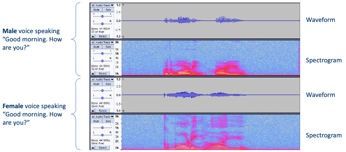
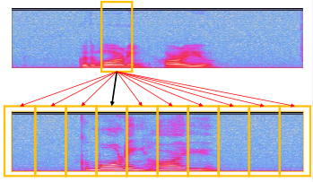
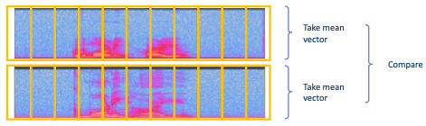
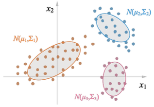
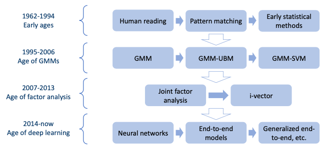

# Section 2: The History of Voice Identity Techniques

## 2.1 What about voices?

voice는 마치 지문처럼 사람마다 모두 다른 특징을 갖는다.(voiceprint) 게다가 같은 사람이 동일한 단어/음소를 발음하더라도 상황에 따라 다르게 발음할 수 있다.(**variation**) 

게다가 **human reading**은 다음과 같은 어려움이 있기 때문에, **algorithm**을 이용한 voice identification의 필요성이 대두되었다.

- cost

    - voice identification을 위해서는 사람을 고용하고 훈련해야 한다.

    - 기술이 필요한 다양한 장소(공항, 경찰서 등)에 deploy해야 한다.

    > algorithm: 한 번 개발하면 어디든 deploy할 수 있다.

- unreliable

    - 같은 traning을 거쳐도 사람마다 다른 결과를 보인다.

    - 사람은 익힌 기술을 망각할 수 있다.

    > algorithm: 같은 입력을 주면 언제나 같은 출력을 내보낸다.

---

## 2.2 Earliest algorithm: Pattern matching

human reading에서 영감을 받아 spectrogram을 이용한 pattern matching 방법이 제시되었다.

위 spectrogram을 행렬 $A$ , 아래 spectrogram을 행렬 $B$ 라고 하자. 이 둘을 비교하는 수식은 다음과 같다.

$$ ||A - B||_{2} $$

$$ \mathrm{corr}(A, B) $$

- `corr`: 두 인자의 correlation coefficient를 반환하는 Python function

- norm이 작을수록 correlation이 크다.

    다시 말해 두 행렬(spectrogram)이 유사하며 같은 speaker일 가능성이 크다.

단, 다음과 같은 전제조건(**prerequisite**)가 필요하다.

- same content

    다시 말해 pattern matching은 **Text-dependent**하다.

- alignment

    예를 들어 비교를 위해서는 'Good vs Good', 'Morning vs Morning'이 서로 alignment되어야 한다.

---

### 2.2.1 Limitations of pattern matching

그러나 데이터가 서로 다른 speaking rate를 가지고 있다면 align할 수 없다. 따라서 이러한 문제를 해결하기 위해 **per-segment** matching이 등장했다.

- A, B의 각 segment를 비교한 뒤 best match를 찾는다.

- 두 spectrogram이 align되어 있지 않아도 비교할 수 있다.

---

## 2.3 Early Statistical Methods

pattern matching은 **variations**을 고려하지 못한다. 다양한 요소에 의해 같은 단어라도 variation이 생길 수 있다.

> recording devices, ambient noise, emotions, utterance(발화) 등

따라서 이러한 variation을 고려할 수 있도록 **statistical methods**가 등장했다. 

- 제일 간단한 방법으로는 두 **mean vector**를 비교할 수 있다.

    

---

### 2.3.1 Gaussian Mixture Models(GMM)

**Gaussian Mixture Models**(GMM)은 Deep Learning이 등장하기 전 제일 보편적으로 쓰인 statistical model이다.

> Speacker Recognition만이 아니라, Computer Vision, Speech Recognition 등 다양한 분야에서 쓰였다.

> Speaker Recognition에서 시대별로 dominant model을 살펴보면, 1995-2006:GMM / 2007-2013: Factor analysis / 현재: Joint Factor Analysis(JFA), i-vector

- GMM은 **mixture of Gaussian distributions**이다.

    - 각 Gaussian distribution은 **cluster**를 의미한다.

    - 각 cluster는 **speaker**를 의미한다.

게다가 이러한 Gaussian distribution은 단순할 뿐더러, complex distribution을 simple Gaussian distribution의 합으로 근사할 수 있다는 장점이 있다.

GMM의 변형도 여러가지가 존재하는데 대표적으로는 두 가지가 있다.

- **Gaussian Mixture Model - Universal Background Model**(GMM-UBM)

- **Gaussian Mixture Model - Support Vector Machines**(GMM-SVM)

---

## 2.4 Deep Learning

GMM이 complex functions을 simple Gaussian distribution의 합으로 근사하는 것처럼, NN은 complex functions를 simple function(neuron)의 합으로 근사한다.

특히 speech signal(sequence data)에 있어서 **Recurrent Neural Network**(RNN)은 굉장히 효과적이다.

> big data에 더 효과적이며 GPU, TPU 등의 발전으로 더욱 효율적으로 학습할 수 있게 되었다는 배경도 있다.

다음은 Speaker Recognition에서 대표적인 모델을 시대에 따라 정리한 것이다.

- Google: d-vector(d = deep)

    - 2014: First DNN based speaker recognition system

    - 2016: First End-to-End system

    - 2018: Generalized End-to-End loss, attention based system 등

- Baidu:

    - 2017: Deep Speaker system

- JHU

    - 2018: X-vector

- SJTU

    - 2015: J-vector

---

## 2.5 Summary

---