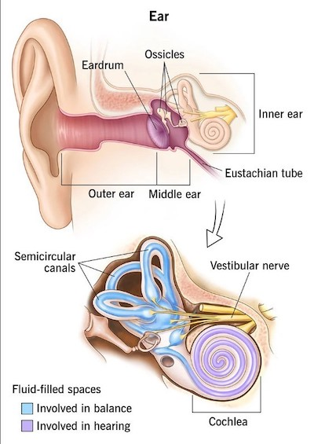

# Section 3: Fundamental of Audio Processing

## 3.1 Audio Processing

**audio signals**의 종류는 굉장히 다양하다.

- Speech

    사람에 의해 **articulate**된 sounds이다. socially meaningful하며, 보통 생각이나 감정을 표현한다.

- Not from humans

    car engine sounds, musical instruments, animal sounds 등

- Not from articulatory organs

    clapping, fart 등

- Not socially meaningful

    coughs, snoring, sneezing, hiccups 등

---

### 3.1.1 utterance

**utterance**란 speech signal의 audio clip을 의미한다. 따라서 다양한 attributes를 가지고 있다. 아래는 대표적인 attributes 예시다.

- speaker

- language

- transcript/phrase

---

### 3.1.2 generation of sounds

sound는 매질(gas, liquid, solid 등)을 통해 전파되는 acoustic wave(vibration)이다.

---

### 3.1.3 generation of speech

speech는 vocal organs에 의해 만들어진다.

- vocal folds(성대): vibrate

- glottis(성문): air flow를 조절

- vocal tract(성도): sound를 modulate

---

### 3.1.4 Sine wave

복잡한 sound waveform을 분석하기 앞서, 기본이 되는 sine wave(sinusoid)에 대해 알아보자.

> $f = 5Hz$ , $A = 1$ , $\phi = 0$

- $y(t) = A \sin(2\pi f t + \phi)$

- $A$ : amplitude

- $f$ : frequency

- $w = 2\pi f$ : angular frequency

- $T = {{1} \over {f}}$ : period

- $\phi$ : phase

---

### 3.1.5 Fourier analysis

**Fourier analysis**는 복잡한 signal을 여러개의 sine, cosine wave의 합으로 분해한다.

$$ s_{N}(x) = {{a_0} \over {2}} + \sum_{n=1}^{N}(a_n \cos ({{2\pi} \over {P}}nx) + b_n \sin({{2\pi} \over {P}}nx)) $$

$$ a_n = {{2} \over {P}} \int_{0}^{P} s(x) \cos({{2\pi} \over {P}}nx) dx $$

$$ b_n = {{2} \over {P}} \int_{0}^{P} s(x) \sin({{2\pi} \over {P}}nx) dx $$

---

### 3.1.6 Spectrum

Fourier analysis를 이용하면 sound wave를 **spectrum**으로 시각화할 수 있다.

다음은 두 개의 sine wave( $f_1 = 5Hz$ , $A = 2$  / $f_2 = 50Hz$ , $A = 1$ )를 합친 signal을, Fourier analysis를 적용하여 얻어낸 spectrum이다.

- x축: sine wave component의 frequency

- y축: sine wave component의 amplitude

---

## 3.2 Frequancy of sound

마치 빛의 electromagnetic spectrum(radio → microwave → infrared → **visible** → ultraviolet → X-ray)처럼, sound도 frequency에 따라 여러 종류로 나뉜다.

- **Acoustic**

    사람은 20Hz ~ 20kHz frequency를 가진 sound를 들을 수 있다.

---

### 3.2.1 Fundamental frequency and pitch

- **fundamental frequency**(**F0**)

    - Generic signal: **lowest frequency**를 갖는 component를 의미한다. 

    - Speech: vocal fold vibration에서의 frequency를 의미한다.

    

- **pitch**

    F0에 대한 사람의 perception이다.

    - 시간에 따른 F0 변화는 'pitch track'으로 표현한다.

        > 예를 들면 노래방에서 볼 수 있는 memody line이 이에 해당된다.

---

### 3.2.2 formant

**formant**(포먼트)란 resonance(공명)이 일어나는 특정 frequency를 의미한다. 

- 사람의 formant에서 첫 번째와 두 번째 formant를 F1, F2로 지칭한다.

---

### 3.2.3 intensity and loudness

**intensity**란 signal의 power에 대응되는 개념이다. 예를 들어 주기(period) $T$ 를 갖는 signal $y$ 가 있다고 하자.

$$ y = f(t) $$

Power는 다음과 같이 정의된다.

$$ P = {{1} \over {T}}\int_{0}^{T} (f(t))^2 dx $$

하지만 소리의 크기를 전력, 전압을 통해 다루는 것은 불편하고 복잡하기 때문에, 상대적인 비교값에 해당되는 intensity를 정의하여 사용한다.

intensity는 Power와 Power의 Auditory threshold $P_0$ 를 이용하여 intensity를 정의할 수 있다. 단위는 decibel(dB)를 사용한다.

$$ L_{dB} = 20 \log_{10}({{P} \over {P_0}}) $$

간혹 intensity를 power 대신 **sound pressure**를 바탕으로 정의하기도 한다. 이 경우 intensity는 다음과 같이 정의된다.

$$ L_{dB} = 20 \log_{10} \left({{P_{rms}} \over {P_{ref}}}\right) $$

- $P_{rms}$ : 측정한 sound pressure의 root mean square

- $P_{ref}$ : standard reference sound pressure (20 micropascals)

**loudness**는 intensity에 대한 사람의 perception이다.

---

## 3.3 Nonlinearity of human hearing

> [cleveland clinic: ear anatomy](https://my.clevelandclinic.org/health/body/24048-ear)

사람의 귀는 nonlinear하다.

- **ear canal**(외이도)

    resonant frequancies를 가지며, 몇몇 frequency를 amplifiy/attenuate한다.

- **ossicles**(귓속뼈, 청소골)

    특정 intensity range에서 linear하게 작동하며, 이외의 범위에서는 inner ear를 지키기 위해 **nonlinear**하게 작동한다.

- **cochlea**(달팽이관, 와우)

    여러 위치의 hair cells(유모세포)가 각자 다른 frequencies를 감지한다.

> 이러한 특징 때문에 사람이 인식하는 sound는 logarithm distribution에 가깝다. 

nonlinearity는 두 가지 관점에서 설명할 수 있다.

- Nonlinearity of **frequency**

- Nonlinearity of **intensity**

---

### 3.3.1 Nonlinearity of frequency: Bark scale

1961년 제안된 **Bark scale**은 사람의 hearing range를 고려하여 24개의 frequency band로 나눈 scale을 의미한다. 

- 500Hz 이하에서는 linear 형태를 갖는다.

- 500Hz를 넘어가면 logarithmic 형태를 갖는다.

frequency를 Bark scale로 approximation하는 식은 다음과 같다.

$$ 1Bark \approx \begin{cases} f/100, & f \le 500Hz \\ 9 + 4 \log_{2}(f/1000), & f > 500Hz \end{cases}$$

---

### 3.3.2 Nonlinearity of frequency: Mel scale

**Mel scale**도 마찬가지로 사람의 hearing range를 고려하여 제안된 scale로, Bark scale과 다르게 **continuous**하다는 특징을 갖는다.

- 좌측: Bark scale, 우측: Mel scale

> Mel: Melody에서 유래

$f = 1000Hz, m = 1000mel$ 에서 frequency conversion은 다음과 같다.

$$ m = 2595 \log_{10}(1 + f/700) = 1127 \ln(1+f/700) $$

---

### 3.3.3 Nonlinearity of frequency: other scales

이외 다음과 같은 scale들이 제안되었다.

- **Equivalent Rectangular Bandwidth**(ERB) scale

$$ \mathrm{ERBS}(f) = 21.4 \log_{10}(1 + 0.00437 \cdot f) $$

- **Cochlear frequency-position function** scale (Greenwood scale)

---

### 3.3.4 Nonlinearity of intensity

사람은 smaller amplitude(진폭)을 갖는 signal에 더 민감하다.

---

