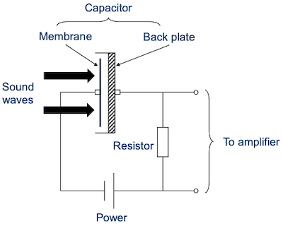
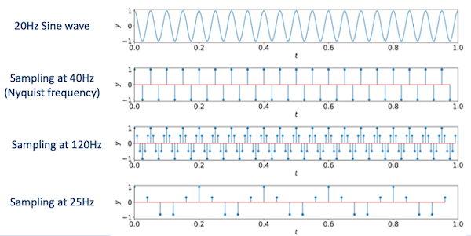
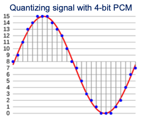
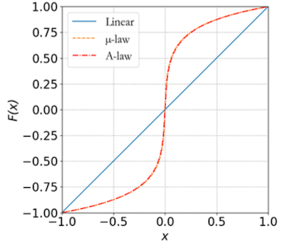
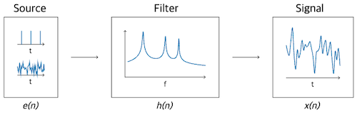
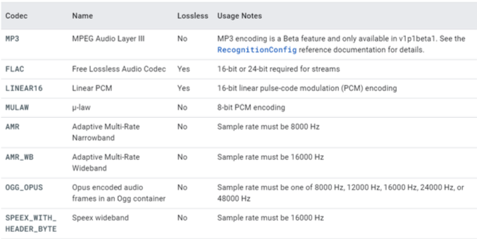
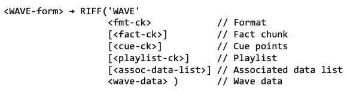
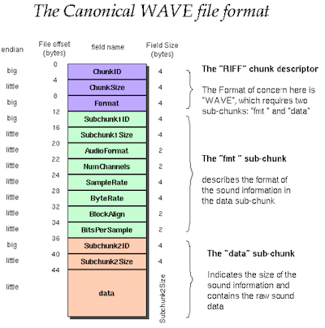
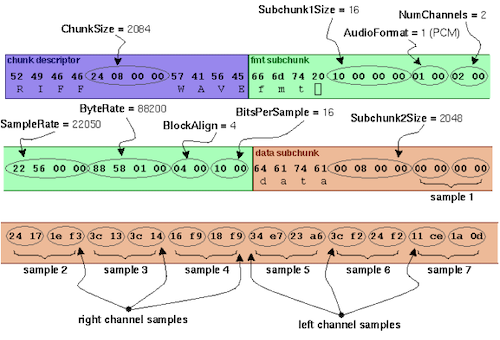

# Section 3: Fundamental of Audio Processing

## 3.4 From human to computers

---

### 3.4.1 Signal collection

**microphone**(마이크)는 sound wave를 electrical signals로 변환하는 transducer(변환기)이다. 

- 공기의 vibration을 **membrane**을 통해 capture한다.

- condenser, dynamic, MEMS, Ribbon 등 다양한 종류의 microphone이 존재한다.

다음은 membrane microphone의 구조이다.



---

### 3.4.2 Phone connector

(생략)

---

## 3.5 Analog-to-digital

컴퓨터에 저장되는 audio signals은 **digital**이다. 따라서 컴퓨터의 Sound cards는 다음과 같은 기능을 갖는다.

- Analog-to-digital converter(ADC)

    **sampling**과 **quantization** 과정을 거쳐서 변환한다.

- Digital-to-analog converter(DAC)

---

### 3.5.1 Sampling

- continuous-time signal을 discrete-time signal로 reduce한다.

- fixed frequency(**sampling rate**) 만큼의 amplitude로 value를 sampling한다.

만약 signal이 **periodic signal**이라면, 주기당 적어도 두 배의 sampling rate가 필요하다.(crest, trough를 모두 sampling하기 위함)

- **Nyquist frequency**

    오직 sample rate의 거의 절반에 해당되는 frequency까지만 표현할 수 있다.

다음은 20Hz sine wave를 여러 sampling rate에서 sampling한 예시다.



- 40Hz
    
    (Nyquist frequency) 20Hz sine wave의 crest, trough를 모두 표현한다.

- 120Hz

    Nyquist frequency보다 커서 더 많은 information을 갖는다. 

    - period는 동일하다.

- 25Hz

    information loss가 발생한다.

---

#### 3.5.1.1 Sampling rate examples

몇 가지 대표적인 sampling rate를 살펴보자.

- cable telephones: 8kHz

- Wideband audio(VoIP): 16kHz

- Audio CD: 44.1kHz

- DVD: 48kHz

- Blu-ray Disk, HD DVD: 96kHz

---

### 3.5.2 Quantization

**quantization**(양자화)란 실수인 amplitude를 integer로 변환하는 과정이다.

- floating point를 그대로 사용하면 너무 많은 memory space/bandwidth를 사용하게 된다.

  - single precision(`float`): 4 bytes

  - double precision(`double`): 8 bytes

quantization은 주로 다음과 같은 종류로 나뉜다.

- 8-bit(256 levels)

- 16-bit(65,536 levels)

- 24-bit(16,777,216 levels)

- signed/unsigned

  - 8-bit signed: -128 ~ 127

  - 8-bit unsigned: 0 ~ 255

---

## 3.6 Audio coding

sampling과 quantization 단계가 끝나면, audio는 integer series로 표현된다. 이를 더 효과적으로 저장하고 전송하기 위해서는 **bytes** 단위로 표현할 필요가 있다.

- Audio **coding** / **encoding**

    digital signal을 bytes로 변환한다.

- Audio **decoding**

    bytes를 digital signal로 변환한다.

---

### 3.6.1 Linear PCM

- **Pulse-Code Modulation**(PCM)

    amplitude를 direct하게 quantization한다.

- **Linear PCM**

    quantization levels이 linearly uniform하게 결정된다.

다음은 16 level로 나뉘어진 Linear PCM 예시이다.



---

### 3.6.2 Non-linear PCM

그러나 사람의 청각은 intensity에 linear하지 않다.(small amplitude에 더 민감하다.)

따라서 samller amplitude일수록 큰 precision을 갖는 **non-linear PCM**이 더 효과적이다.

두 가지 대표적인 non-linear PCM으로는 다음과 같은 기법이 있다.

> 먼저 $x \in [-1, 1]$ , $\mathrm{sgn}(x)$ : sign function으로 가정한다.

- μ-law

$$ F(x) = \mathrm{sgn}(x){{ln(1+\mu|x|)} \over {\ln(l+\mu)}} $$

- A-law

$$ F(x) = \mathrm{sgn}(x) \begin{cases} {{A|x|} \over {1 + \ln A}}, & |x| < {1 \over A} \\ {{1 + \ln(A|x|)} \over {1+ \ln A}}, & {{1} \over {A}} \le |x| \le 1 \end{cases} $$

μ-law, A-law 모두 다음과 같은 조건을 만족한다.

$$F(x) = x \quad when \, \, x \in {0, -1, 1}$$

> 만약 8-bit coding이라면 μ=255, A=87.6 값을 갖는다.



---

### 3.6.3 Adaptive PCM

linear, non-linear PCM은 모든 sample에서 global strategy로 적용된다. 하지만 시간에 따라 signal이 갖는 amplitude는 바뀔 수 있다.

- amplitude가 커지면 범위를 cover해야 한다.

- amplitude가 작아지면 precision이 더 필요하다.

이러한 문제를 **adaptive PCM**은 local amplitude를 normalize한 뒤 quantization을 적용하여 해결한다.

---

### 3.6.4 Differential PCM

sampled series $x[n]$ 가 있다고 하자. 

- ~3.6.3절 PCM: $x[n]$ 을 directly quantize한다.

- **Differential PCM**(DPCM): consecutive value(연속된 값)의 **delta**를 사용한다.

$$ e[n] = x[n] - x[n-1] $$

> $e$ : prediction error

delta를 사용하는 이유는 $e[n]$ 이 갖는 dynamic range가 $x[n]$ 보다 훨씬 작기 때문에, 매우 작은 bit rate로도 효과적으로 표현할 수 있기 때문이다.

---

### 3.6.5 Linear Predictive Coding

**Linear Predictive Coding**(LPC)은 DPCM보다 더 generic한 표현이다. 둘의 차이를 비교하며 알아보자.

- DPCM

    $x[n]$ 을 구하기 위해서는, 오직 하나의 past value $x[n-1]$ 만 필요하다.

    $$ x[n] = x[n-1] + e[n] $$

- LPC

    $x[n]$ 은 past value $p$ 의 linear combination와 prediction error $e$ 의 합으로 표현된다.

    $$ x[n] = \tilde{x}[n] + e[n] = \sum_{i=1}^{p} a_i x[n-i] + e[n] $$

    - $p$ : past value

    - $\tilde{x}[n]$ : predicted value

    - $a_i$ : predictor coefficients

---

#### 3.6.5.1 Derivation of LPC

> [Linear Predictive Coding is All-Pole Resonance Modeling](https://ccrma.stanford.edu/~hskim08/lpc/)

human voice production에서 signal이 만들어지는 과정을 복습해 보자.



- source(vocal chords, 성대) $e(n)$ $\rightarrow$ filter(vocal tract, model) $h(n)$ $\rightarrow$ signal $x(n)$

$$ x(n) = h(n) \ast e(n) $$

그러나 현재 알고 있는 정보는 오직 $x(n)$ ,즉 resulting siganl뿐이다. 이 정보를 바탕으로 $e(n)$ 과 $h(n)$ 를 추정해야 한다. 

- Filter: p-th order all-pole filter로 가정한다.

    - 각 pole은 delay에 대응된다. 
    
    - system은 memory를 가지며, 현재의 sample $x(n)$ 은 input $e(n)$ 와 과거의 samples $x(n-k)$ ( $k=1, ..., p$ )의 연산으로 얻어진다.

따라서 다음과 같이 수식을 유도할 수 있다.

$$ X(z) = H(z)E(z) = {{1} \over {1 - \sum_{k=1}^{p}a_k z^{-k}}}E(z) $$

- X(z) : input $E(z)$ , past samples $z^{-k} X(z)$ 의 표현으로 나타낼 수 있다.

$$ X(z) = \sum_{k=1}^{p}a_kz^{-k}X(z) + E(z) $$

$$ 𝒵 \Leftrightarrow x(n) = \sum_{k=1}^{p}a_k x(n-k) + e(n) $$

---

### 3.6.6 Other coding approaches

이외에도 다양한 audio coding 기법이 존재한다.

- Adaptive + differential = ADPCM

- Delta modulation

   $e[n]$ 으로 single bit를 사용한다.

   - $e[n] > \triangle$ : 0으로 양자화

   - $e[n] < -\triangle$ : 1로 양자화

   - otherwise: 0 and 1 interleaved

- Adaptive delta modulation(ADM)

    $\triangle$ 를 adaptive하게 결정한다.(fixed value를 사용하지 않는다.)

---

### 3.6.7 Frequency domain coding

> ~3.6.6절까지는 waveform signal을 기반으로 한 접근법이다.

> Frequency domain coding은 speech보다는 music에서 더 사용되는 기법이다.

대표적인 **Frequency domain coding**으로 다음과 같은 기법이 있다.

- **Sub-Band Coding**(SBC)

    각 frequency band를 분리하여 encoding한다.

- **Adaptive Transform Coding**(ATC)

    signal을 다른 형태(예: discrete cosine transform)으로 변환한다.

---

### 3.6.8 Case study: Google Cloud Speech-To-Text

Google Cloud에서 제공하는 Speech-To-Text API를 사용하려면, audio coding 기법이 무엇인지 특정해야 한다. 다음은 API가 지원하는 audio encoding 기법 목록이다.



- LINEAR16: 16-bits Linear PCM

- MULAW: 8-bits μ-law PCM

---

## 3.7 Audio formats

**audio formats**는 signal encoding에서 어떻게 bit stream으로 표현할지를 정의한다. 이러한 format은 크게 세 종류로 나눌 수 있다.

- Uncompressed

- Lossless compression

- Lossy compression

---

### 3.7.1 WAV format

> [Microsoft WAVE format (.wav)](soundfile.sapp.org)

가장 흔하게 쓰이는 format 중 하나인 **Waveform Audio File Format**(WAV)는 **Resource Interchange File Format**(RIFF)의 application이다.

- RIFF

    

    다양한 chunk로 구성된 header이다.

    > video format인 AVI, ANI와 같은 format도 RIFF의 application이다.

    > Microsoft, IBM에서 개발하였으며, Apple은 AIFF format을 사용한다.



- header

    ID(RIFF), total size, format("WAVE")로 구성된다.

- Format chunk

    Chunk size, Audio coding format, Number of channels, Sample rate, Bits per sample 등으로 구성된다.

- Data chunk

    chunk size, actual data로 구성된다.

---

#### 3.7.1.1 WAV format example

실제 WAV format 예시를 살펴보자.



- 보라색: header

    - 문자 4개: RIFF
    
    - file size(chunk size): 2084

    - 문자 4개: WAVE

- 초록색: format chunk

- 주황색: data chunk

    - 문자 4개: data

    - chunk size: 2048

    - different channel이 **interleaved**되어 있다.

        > 2개 channel(right channel, left channel)

---

### 3.7.2 SPHERE format

**SPeech HEader Resources**(SPHERE)은 대중적인 format은 아니나 speech science에서 많이 사용되는 format 중 하나이다.(`.sph` 확장자를 갖는다.)

> NIST(National Institute of Standards and Technology)에서 개발한 format이다. 따라서 NIST dataset에서 많이 사용되는 format이다.


- 1024 Bytes의 ASCII header를 갖는다.

- Linear PCM coding

- 16,000Hz sampling rate

- Linguistic Data Consortium(LDC) to WAV 변환을 위해 sph2pipe tool을 사용한다.

---

### 3.7.3 Other formats

- Lossless

  - **Free Lossless Audio Codec**(FLAC)

- Lossy

  - **MPEG-1 Audio Layer III**(MP3)

    - Modified discrete cosine transform(MDCT)

    - Sub-band coding

  - **Advanced Audio Coding**(AAC)

  - **OPUS**

  - **Speex**

  - **Windows Media Audio**(WMA)

---

## 3.8 Sound processing programs

- [SoX](https://sox.sourceforge.net/)

    Sound eXchange를 줄여서 SoX로 지칭한다. cross-platform(Windows, Linux, MacOS)이며, 다음과 같은 기능을 제공한다.

    - read/write various audio formats

    - play/record audio

    - simple editing, mixing, analysis

설치는 다음 명령어를 통해 진행한다.

```bash
$ sudo apt install sox
```

- FFmpeg

    MP4와 같은 몇몇 format은 SoX에서 지원하지 않는다. 이러한 경우 FFmpeg를 대안으로 사용한다.

설치는 다음 명령어를 통해 진행한다.

```bash
$ sudo apt install ffmpeg
```

---