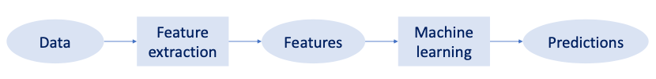
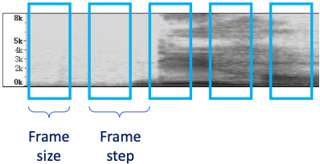
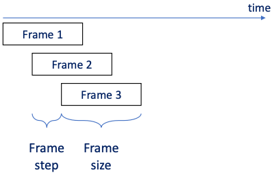
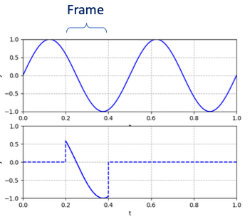
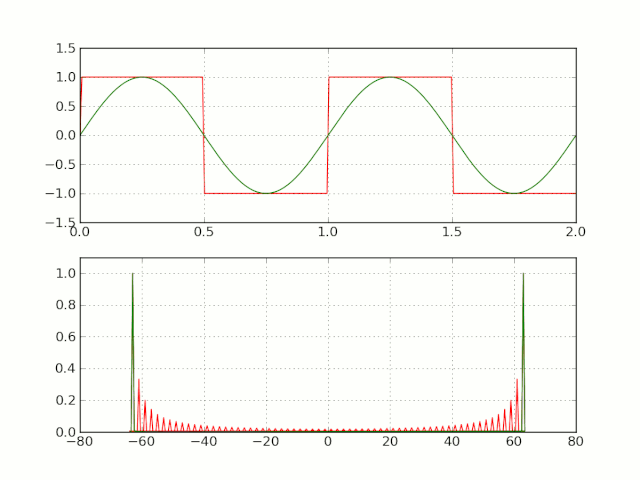
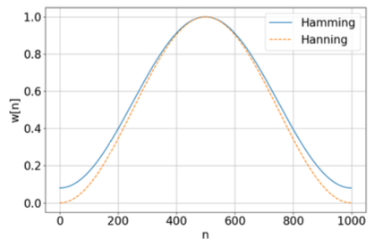
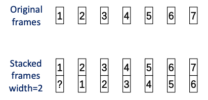
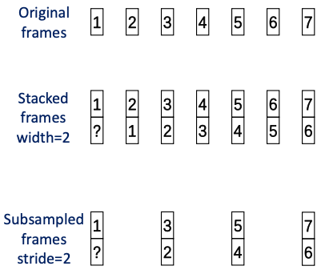
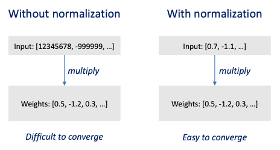
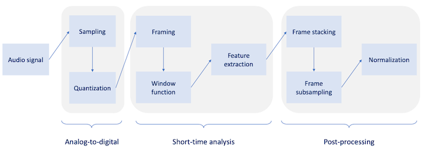

# Section 4: Acoustic Feature Extraction

대부분의 machine learning problem에서 original data를 그대로 사용할 수는 없다. 대신 data에서 feature를 추출한 뒤 이를 바탕으로 model을 학습시킨다.

---

## 4.1 global acoustic feature

우선 entire audio 기준으로 봤을 때의 feature인 **global acoustic feature**를 추출할 수 있다. 

예를 들면 F0(Fundamental frequency)나 F1, F2(formants), intensity 등이 해당된다.

하지만 periodic signal처럼 **stationary signals**일 경우에만 global acoustic feature를 사용하는 의미가 있다.

- 대부분의 audio signal은 not stationary하다. 예를 들어 대부분의 **phoneme**(음소)들은 서로 다른 특징을 갖는다.

- global features를 사용하면서 많은 local features을 무시하게 된다.

- noise에 취약하다.

---

## 4.2 Short-time analysis

하지만 entire audio를 small segments(10~30ms)로 나누면, 각 segment는 stationary하다고 볼 수 있다. 이러한 접근법을 **short-time analysis**라고 한다.

- 이때 segment를 **frame**이라고 지칭한다.

  > video에서의 frame과는 다른 개념이다. video frame은 사람이 실제로 보는 image를 의미하지만, audio frame을 사람이 frame 단위로 듣지는 않는다.

---

### 4.2.1 Framing

- **frame size**

    frame이 cover하는 duration을 뜻한다.

- **frame step/stride**

    이어지는 frame 사이의 temporal distance를 뜻한다.

frame parameter에 따라서 세 가지 condition이 존재한다.

- size > step

    가장 흔한 case로, frame이 overlapped sample을 갖는다.

- size = step

    frame이 서로 exclusive하다.

- size < step

    frame 사이에 gap이 존재한다. 즉, **lossy**하다.

### &nbsp;&nbsp;&nbsp;📝 예제 1: Framing &nbsp;&nbsp;&nbsp;

다음과 같은 조건에서 \#frames, samples per frame을 구하라.

- Input: 1 second audio with 16kHz sampling rate

- Frame size: 25ms

- Frame step(stride): 10ms

### &nbsp;&nbsp;&nbsp;🔍 풀이&nbsp;&nbsp;&nbsp;

- \#frames

   1,000ms / 10ms = 100 frames

- \#samples per frame

   16kHz \* 0.025s = 400 samples

size > step이므로 다음과 같이 overlap되는 frame이 생성된다.

---

### 4.2.2 Window function

하지만 framing 후 frame의 edge 부분에서 discontinuity가 발생한다. 

이러한 discontinuity를 가진 채 Fourier transform을 적용하면 **Gibbs phenomenon**(깁스 현상)이 발생한다.

- 원하지 않는 high frequency component가 생긴다.

- spectral leakage(스펙트럼 누설)이 발생한다.

  > spectral leakage: 원래 signal에는 없는 frequency가 관측되는 현상

이를 해결하기 위해서 **window function**을 사용한다. 

- near-edge values: 0에 가깝게 줄인다.

- middle-frame values: 건들지 않는다.

대표적인 window function으로는 세 가지가 있다.

- Gaussian

- Hanning

- Hamming

---

#### 4.2.2.1 Hanning window, Hamming window

discrete signal $x[n]$ ( $0 \le n \le N-1$ )에서, Hanning, Hamming window function의 weight $w[n]$ 은 다음과 같은 분포를 갖는다.

$$ w[n] = (1 - \alpha) - \alpha \cos{{2\pi n} \over {N-1}} $$

- Hanning: $\alpha = 0.5$

- Hamming: $\alpha = 0.46$

---

## 4.3 Frame post-processing

이제 windowed frame에서 feature를 추출해야 한다. 하지만 model의 입력으로 사용하기 위해서는 post-processing 절차가 추가로 필요하다.

- **Frame stacking**

    이웃한 frames를 묶어서 하나의 super frame으로 만든다.

- **Frame subsampling**

    몇몇 frame을 제거(drop)한다.

- **Frame normalization**

    normal distribution을 갖도록 optimize한다.

---

### 4.3.1 Frame stacking

context information을 더 얻기 위해서 **frame stacking** 기법을 적용한다.

다음은 width 2로 frame stacking을 적용한 예시다.

- 각 frame dimension이 2배가 된다.

- edge case

  이웃하는 frame을 copy하거나, globally averaged frame을 사용한다.

---

### 4.3.2 Frame subsampling

computation cost를 줄이고, memory space를 효율적으로 사용하기 위해 **frame subsampling**을 추가로 적용한다.

---

### 4.3.3 Frame normalization

다음으로 model convergence를 원활히 할 수 있도록 **frame normalization**를 적용한다.

normalized value $y_i$ 는 다음과 같이 normalize된다.

$$ y_i = (x_i - {\mu}_i)/{\sigma}_i $$

- $x_i$ : element

- ${\mu}_i$ : global mean

- ${\sigma}_i$ : global standard deviation

---

## 4.4 Summary: From audio to feature

---
