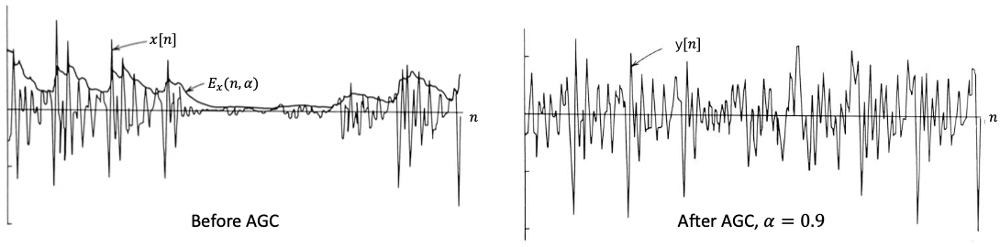
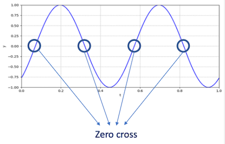
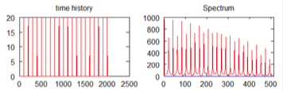
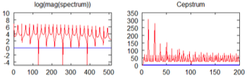
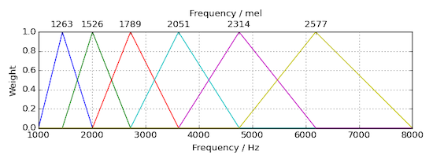
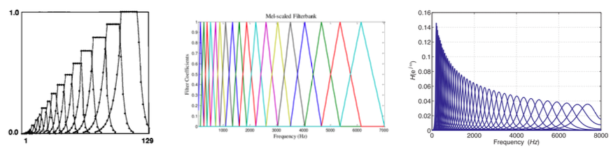

# Section 4: Acoustic Feature Extraction

> [Pitch detction(ACF, AMDF, Cepstrum) 정리](https://sanghyu.tistory.com/40)

## 4.5 Two types of features

- **Time domain feature**

    - waveform samples에서 direct하게 feature를 추출한다.

    - 따라서 Fourier Transform을 적용할 필요가 없다.

- **Frequency domain feature**

    - Fourier transform을 적용하여 frequency domain에서 feature를 추출한다.

    - 대부분의 system이 frequency domain feature를 사용한다.

---

## 4.6 Time domain features

Time domain features는 크게 여섯 종류로 나눌 수 있다.

- Short-time energy

- Short-time average magnitude

- Short-time zero cross rate(ZCR)

- Short-time auto-correlation

- Short-time average magnitude difference function (AMDF)

- Short-time linear predictive coding

--- 

### 4.6.1 Short-time energy and average magnitude

> 주로 **Voice Activity Detection**(VAD)에서 사용된다.

> Voice Activity Detection(VAD): speech signal에서 speech와 non-speech(silence) segment를 구분하는 task. 일반적으로 speech의 energy가 더 크게 나타난다.

framed sample $x[n]$ 이 있다고 하자.

- $0 \le n \le N-1$

- $N$ : frame 내 \#samples

Short-time energy $E_x$ 는 다음과 같이 정의할 수 있다.

$$ E_x = \sum_{n=0}^{N-1}(x[n])^{2} $$

> 제곱항이 있는 이유는 small, large magnitude 간의 차이를 amplifiy하기 위해서이다.

Short-time average magnitude $M_x$ 는 다음과 같이 정의한다.

$$ M_x = {{1} \over {N}}\sum_{n=0}^{N-1}|x[n]| $$

---

#### 4.6.1.1 Use case: Automatic Gain Control

input magnitude가 가변적이더라도, output magnitude를 일정한 크기로 유지하고 싶을 때가 있다. 이를 위한 방법인 **Automatic Gain Control**(AGC)은 다음과 같이 정의한다.

$$ E_x(n, \alpha) = (1-\alpha)\sum_{i=-\infty}^{N-1} {\alpha}^{n-i-1}(x[i])^{2} $$

$$ \quad \quad = (1-\alpha)(x^2[n-1] + \alpha x^2[n-2] + \cdots) $$

- $0 < \alpha < 1$

- After AGC: $y[n] = x[n]/\sqrt{E_x(n, \alpha)}$

다음은 AGC를 적용한 후의 magnitude를 시각화한 예시이다.



---

### 4.6.2 Short-time zero cross rate

> 가장 기본적인 Pitch Detection Algorithm으로 사용되었다.

Zero Cross Rate(ZCR)는 이름 그대로 얼마나 자주 $y=0$ 을 cross하는지의 비율을 나타낸다.(= signal 부호가 바뀌는 비율)

- frequency와의 correlation을 갖는다.



수식으로 Short-time ZCR을 표현하면 다음과 같다.

$$ Z_x = {1 \over 2} \sum_{n=1}^{N-1}|\mathrm{sgn}(x[n]) - \mathrm{sgn}(x[n-1])| $$

- 이때 $\mathrm{sgn}$ 함수는 다음과 같다.

$$ \mathrm{sgn}(x) = \begin{cases} 1, & if \, x>0 \\ -1, & if \, x<0 \end{cases} $$

---

### 4.6.3 Short-time autocorrelation

> 주로 noise를 포함한 signal에서 주기 검출을 위해 사용한다.

**short-time autocorrelation**은 $k$ samples만큼 delay한 signal과 original signal 사이의 correlation을 구한다. 수식은 다음과 같다.

$$ R_x(k) = \sum_{n=0}^{N-1-k}x[n] \cdot x[n+k] $$

- pitch detection에서 유용하다.

- $k$ 가 period의 배수일 때 correlation이 최대가 된다.

---

### 4.6.4 Short-time average magnitude difference function

**Average Magnitude Difference Function**(AMDF)는 $k$ samples만큼 delay한 signal과 original signal 사이의 차이를 구한다.

우선 difference는 다음과 같이 정의할 수 있다.

$$ d_x(n,k) = x[n] - x[n-k] $$

- 만약 periodic signal이라면, 주기 $T$ 일 때 다음과 같이 difference는 0이 된다.

$$ d_x(n, T) = 0 $$

Short-time AMDF는 다음과 같이 정의한다.

```math
{\gamma}_{x}(k) = \sum_{n=0}^{N-1-k}|x[n+k]-x[n]|
```

- pitch detection에서 유용하다.

    - 곱셈 연산을 하는 Short-time autocorrelation과 달리, 뺄셈 연산인 만큼 연산량이 더 적다는 장점을 갖는다.

    - 하지만 정확성 측면에서는 성능이 떨어진다.

---

### 4.6.5 Short-time linear predictive coding

> automatic speech나 speaker recognition에서 활용한다. 예를 들어 음성 생성 모델의 parameter(특히 vocal tract filter)를 예측하는 데 사용한다.

> 낮은 bit rate의 신호 표현(압축)을 위해 사용할 수도 있다.

다음과 같이 각 sample을 previous sample의 linear combination으로 근사할 수 있다고 가정한다. 이 가정을 통해 과거의 samples로 현재 sample을 예측할 수 있다.

앞서 audio coding(Section03)에서 다룬 Linear Predictive Coding 식을 다시 살펴보자.

$$ x[n] = \tilde{x}[n] + e[n] = \sum_{i=1}^{p}a_{i}x[n-i] + e[n] $$

이때 $n = p, ..., N-1$ 에서 prediction error $e[n]$ 을 0으로 두면 **연립 일차 방정식**(system of linear equations)을 얻을 수 있다.

- equation 수: $N-p$

- LPC coefficients: $a_1, ...,a_p$

이제 연립 방정식의 해(coefficients)를 찾아야 한다. 이는 **least squares method**(LSQ) 방법을 이용하여 얻을 수 있다.

- solution $\lbrace a_i {\rbrace}_{1 \le i \le p}$

    short-time features group으로써 쓰인다.

- **Linear Predictive Cepstral Coefficient**(LPCC)

```math
$C_0 = \ln p$
```

```math
C_m = {\alpha}_m + \sum_{k=1}^{m-1}{{k} \over {m}}C_k {\alpha}_{m-k} \quad when \, 1<m<p
```

```math
C_m = \sum_{k=m-p}^{m-1}{{k} \over {m}}C_k {\alpha}_{m-k} \quad when \, m>p
```
  
---

## 4.7 Frequency domain features
 
frequency domain features를 얻기 위해서는, signal 종류에 따라 다양한 방식의 **Fourier analysis**을 적용해야 한다.

| Type of signal | Fourier analysis method |
| :---: | :---: |
| Periodic continuous signal | Fourier series |
| Non-periodic continuous signal | Continuous Fourier transform |
| Periodic discrete sequence | Discrete Fourier series |
| Non-periodic discrete sequence | Discrete-time Fourier transform |
| Finite discrete sequence | Discrete Fourier transform |

---

### 4.7.1 Discrete Fourier Transform

> [DFT 정리](https://blog.naver.com/pro_000/221145457432)

Short-time analysis에서 framing, window function을 적용한 samples의 각 frame은 finite discrete sequence이다. 따라서 **Discrete Fourier Transform**(DFT)를 적용한다.

$x[n]$ 를 time index $0 \le n \le N-1$ 에서의 sequence로 가정했을 때, DFT 수식은 다음과 같다.( $N$ : input size )

$$ \hat{x}[k] = \sum_{n=0}^{N-1}\exp(-i{{2\pi} \over {N}}nk)\cdot x[n] $$

- frequency index $0 \le k \le N-1$

- $i$ : imaginary unit(허수)

DFT는 다음과 같은 특징을 갖는다.

- $\hat{x}[k]$ 는 **complex** number(복소수)이다.

- magintude $|\hat{x}[k]|$ : $N$ features.

- phase: 보통 무시한다.

- 계산 복잡도는 $O(N^2)$ 이다.

    - $N$ outputs $(\hat{x}[k])$

    - 각 output은 $N$ 개 inputs $(x[n])$ 을 갖는다.

---

### 4.7.2 Fast Fourier Transform

DFT의 계산 복잡도를 줄이기 위해 **divide-and-conquer** 방식을 적용한 것이 바로 **Fast Fourier Transform**(FFT)이다.

- 계산 복잡도는 $O(N\log N)$ 이다.

- input size $N$ 은 대부분의 경우에서 $2^K$ , 즉 2의 거듭제곱이 되도록 한다.

- $N \neq 2^K$ 일 경우, sequence의 끝을 zero padding해야 한다. (zero padding을 통해 discontinuity 방지)

### <span style='background-color: #393E46; color: #F7F7F7'>&nbsp;&nbsp;&nbsp;📝 예제 1: zero padding &nbsp;&nbsp;&nbsp;</span>

다음 조건에서 zero padding을 적용하라.

- 16kHz signal, 25ms frame size

- \#samples per frame: 400

### <span style='background-color: #C2B2B2; color: #F7F7F7'>&nbsp;&nbsp;&nbsp;🔍 풀이&nbsp;&nbsp;&nbsp;</span>

$400 \neq 2^K$ 이다. 따라서 112 만큼 zero padding을 추가하여 $512 = 2^9$ 가 되도록 만들고 FFT를 수행한다.

---

### 4.7.3 Short-Time Fourier Transform

**Short-Time Fourier Transform**(STFT)는 세 가지 step으로 구성된 개념이다.

- Framing

- Window function

- FFT

STFT의 output을 **spectrogram**(스펙트로그램)으로 지칭한다.

---

### 4.7.4 Cepstrum

**Cepstrum**을 **Spectrum**과의 차이를 비교하며 알아보자.

- **spectrum**

    Fourier Transform 후 output은 다음과 같은 차원을 갖는다.

    - x축: frequency

    - y축: magnitude

- **cepstrum**

    signal $\rightarrow$ Fourier Transform $\rightarrow$ magnitude $\rightarrow$ logarithm $\rightarrow$ inverse Fourier transform

    > "quefrency analysis"로도 불린다.

    > Spec $\rightarrow$ Ceps, freque $\rightarrow$ quefre

그렇다면 어떤 장점이 있어서 Cepstrum을 사용할까? spectrum과 비교하며 알아보자.

- spectrum

  time signal의 periodic structure를 분석하기 위해 사용한다.

  

  - 꽤 많은 spike가 존재한다.

- cepstrum

  log spectrum의 **periodic structure**를 분석하기 위해 사용한다.

  

특히 연산을 비교했을 때 왜 cepstrum이 유용한지 알 수 있다.

- Time domain: 대부분 **convolutions**을 이용해서 signal을 결합한다.

- Frequency domain: **multiplication**

- Logarithm: **addition**

---

### 4.7.5 Demystify differency types of figures

| Type of figure | x축 | y축 | 색깔 |
| :---: | :---: | :---: | :---: |
| Spectrum | Frequency | Magnitude | N/A |
| Phase spectrum | Frequency | Phase | N/A |
| Power spectrum | Frequency | Magnitude squared | N/A |
| Cepstrum | Quefrency | Magnitude | N/A |
| Spectrogram | Time | Frequency | Magnitude |

---

## 4.8 Commonly used features

크게 네 가지 대표적인 feature를 살펴보자.

---

### 4.8.1 Perceptual Linear Prediction

**Perceptual Linear Prediction**(PLP)는 다음과 같은 절차로 진행된다.

1. Framing and window function

    original setup: frame size fo 20ms, Hamming window

2. 각 frame에 FFT를 적용한다.

    $2^K$ 가 되도록 zero padding을 거친다.

3. power spectrum을 계산 후, Bark scale을 적용한다.

4. Critial-band analysis

    Critical-band curve는 다음과 같이 정의된다.

$$ \Psi (\Omega) = \begin{cases} 0, & for \, \Omega < -1.3, \\ 10^{2.5(\Omega + 0.5)} & for \, -1.3 \le \Omega \le -0.5, \\ 1 & for \, -0.5 < \Omega < 0.5, \\ 10^{-1.0(\Omega - 0.5)} & for \, 0.5 \le \Omega \le 2.5, \\ 0 & for \, \Omega < 2.5 \end{cases} $$

5. Equal-loudness preemphasis

6. Power-law for intensity

    human hearing이 intensity에 nonlinear한 특성을 반영한다.

$$ y = x^{1 \over 3} $$

7. Inverse DFT

    Autoregressive modeling

> PLP를 발전시킨 **RASTA-PLP** 기법도 있다.

---

### 4.8.2 Mel-Frequency Cepstral Coefficient

**Mel-Frequency Cepstral Coefficient**(MFCC)는 다음과 같은 절차로 진행된다.

1. Preemphasis

    high frequencies에서의 energy 양을 증폭시킨다.

    - $0.9 \le \alpha < 1.0$

$$ y[n] = x[n] - \alpha x[n-1] $$

2. Framming, window function

3. FFT on each frame

4. Mel filterbanks

    **Mel scale**을 적용시킨다.(Triangular filters를 사용)

    

5. Logarithm

$$ y = \log x $$

6. Inverse DFT

    cepstrum을 계산한다.

7. Include deltas and energy

7번 과정의 예시를 살펴보자. inverse DFT를 거쳐 12 cepstral coefficients를 얻었다고 하자. 이제 다음과 같은 feature를 추가로 포함시킨다.

- 13번째 feature: energy of the frame

- delta / velocity 13개: $d(t) = {{c(t+1) - c(t-1)} \over {2}}$

- double delta / acceleration 13개

최종적으로 MFCC는 $12 + 1 + 13 + 13 = 39$ 즉, 39-dimensional fiatures를 얻는다.

---

### 4.8.3 Power-Normalized Cepstral Coefficients

**Power-Normalized Cepstral Coefficients**(PNCC)은 PLP, MFCC와 비슷하면서 몇 가지 modification이 있는 방법이다.

| Component | PLP | MFCC | PNCC |
| --- | --- | --- | --- |
| Preprocessing | N/A | Preemphasis | Preemphasis |
| Short-time analysis | STFT | STFT | STFT |
| Nonlinearity in frequency | Bark scale, critical-band | Mel-filterbanks | Gammatone filterbanks |
| Environmental compensation | N/A | N/A | Asymmetric noise suppression etc. |
| Nonlinearity in intensity | $y=x^{1/3}$ | $y = \log x$ | $y = x^{1/15}$ |
| Postprocessing | Inverse DFT | Inverse DFT | Inverse DFT |

위 세 가지 방법의 공통점과 차이점을 비교해 보자.

- 공통점

  - STFT를 기반으로 한다.

  - frequency, intensity의 nonlinearity를 compensate한다.

  - 각 component로 어떤 방법을 사용하는가의 차이다.

- 차이점

  - 사용하는 scales/filterbanks가 다르다.

    각각 critical-band, Mel filterbanks, Gammatone filterbanks이다.

    > 차이는 있으나 high frequency filter는 모두 wider하다.

    

---

### 4.8.4 Log-mel Filterbank Energies

**Log-mel FilterBank Energies**(LFBE)는 MFCC를 단순화한 방법으로 볼 수 있다. 현재 산업에서 가장 많이 사용되는 방법이다.

- STFT + Mel filterbanks + Logarithm

- \#features: \#filterbanks에 따라 결정된다.

---

## 4.9 Feature extraction in Python

다음 세 가지 Python library를 사용해서 feature를 추출할 것이다.

```bash
pip install librosa
pip install python_speech_features
pip install pyAudioAnalysis
```

---

### 4.9.1 MFCC in Python

다음은 `librosa`를 이용해서 NFCC feature extraction을 수행하는 Python 코드 예시다.

- `n_mfcc`: `n_mels`보다 크면 안 된다.

> deltas, energy를 포함하지 않는 구현 예제다.

```Python
S = librosa.feature.mfcc(
    y=None,             # audio waveform as time series
    sr=22050,           # y의 sampling rate
    S=None,             # spectrogram
    n_mfcc=20,          # number of MFCCs to return
    dct_type=2,         # DCT type
    norm='ortho',       # norm to use
    lifter=0,           # liftering parameter
    n_fft=2048,         # length of the FFT window(size of FFT)
    hop_length=None,    # number of samples between successive frames
    win_length=None, 
    window='hann',      # window function(Hanning)
    center=True,        # center the frames
    pad_mode='reflect', # padding method
    power=2.0           # power of the magnitude
    n_mels=128,         # number of Mel bands to generate
    fmin=0.0,           # lowest frequency
    fmax=None,          # highest frequency
)
```

`python_speech_features`를 사용한 코드는 다음과 같다.

- `numcep`: `nfilt`보다 크면 안 된다.

> deltas를 포함하지 않는 구현 예제다.

```Python
S = python_speech_features.base.mfcc(
    signal,              # audio waveform at time signal
    samplerate=16000,    
    winlen=0.025,        # STFT frame size at seconds
    winstep=0.01,        # STFT frame step at seconds
    numcep=13,           # number of cepstrum to return
    nfilt=26,            # number of filters
    nfft=512,            # size of FFT
    lowfreq=0,           # lowest frequency[Hz]
    highfreq=None,       # highest frequency[Hz]
    preemph=0.97,
    ceplifter=22,
    appendEnergy=True,
    winfunc=np.hanning    #
)
```

아래는 두 library의 argument를 비교한 도표다.

| arg | librosa | python_speech_features |
| --- | --- | --- |
| Input audio waveform | y | signal |
| Sampling rate | sr | samplerate |
| Output feature dimension | n_mfcc | numcep |
| STFT frame size | win_length | winlen |
| STFT frame step | hop_length | winstep |
| STFT window function | window | winfunc |
| Size of FFT | n_fft | nfft |
| Number of Mel bands | n_mels | nfilt |
| Lowest frequency | f_min | lowfreq |
| Highest frequency | f_max | highfreq |

---