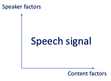
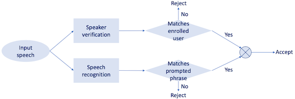
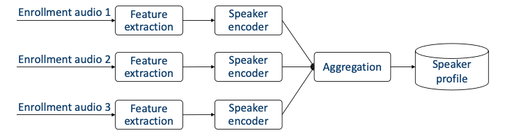
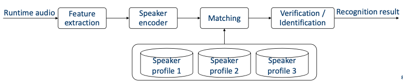
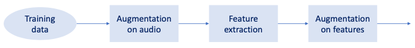

# Section 5: Fundamentals of Speaker Recognition

## 5.1 What is speaker recognition?

**Speaker recognition**(화자 인식) system이 무엇인지 알아보기 전에 다른 개념들과 명확하게 구분지어 보자.

- Voice identity technique $\neq$ speaker recognition

    엄밀히 말하면 speaker recognition은 voice identity technique의 하위 집합이다.(하위 집합이기는 하나 핵심적인 기술에 해당된다.)

    > voice identity technique: speaker diarization, voice clone, voice separation, Personalized VAD/ASR 등

- **"who is speaking?"** 질문에 대한 답을 찾는 기술이다.

- 간혹 다른 명칭으로도 불린다.

  speaker recognition = voice recognition, voiceprint recognition, talker recognition

---

### 5.1.1 Speaker vs speech recognition

또한 speaker recognition과 speech recognition은 서로 다른 개념이다. 두 문제는 서로 orthogonal한 관계이므로 주의해야 한다.

- speaker recognition

  "**Who** is speaking?". 무슨 내용을 말하는지는 중요하지 않다.

  > speech organs(vocal folds, vocal tract), age, gender, language, accent, dialect, life experience, personal preference 등이 중요하다.

- speech recognition

  "**What** was spoken?". 누가 말하는지는 중요하지 않다.

---

## 5.2 Speaker recognition by task

speaker recognition 문제는 분류하고자 하는 크기에 따라, 크게 **Speaker Verification**(SV), **Speaker Identification**(SID) 두 가지 task로 분류할 수 있다.

| Speaker Verification(SV) | Speaker Identification(SID) |
| :---: | :---: |
| single candidate | multiple candidates |
| Yes/No binary classification | 다양한 multi-class classification |
| "Did he/she speak it?" | "Did one of them speak it? If yes, who?" |
| wake up system, security 등에 사용 | Personalization 등에 사용 |

---

### 5.2.1 Speaker Verification

먼저 SV에서는 target speaker가 주어지고, 이 사람이 맞는지 아닌지를 판별하는 문제이다.

- enrollment/registration 과정을 통해 voiceprint representation을 갖는다.

- runtime에서는 voiceprint와 비교하여 score를 계산한다.

- score가 threshold를 넘으면 target speaker로 판별한다.(**binary decision**)

---

### 5.2.1 Speaker Identification

SID는 speaker matching으로도 부르며, $M$ 명의 candidate speaker 집합에서 classification을 수행한다.

- **closed set** SID

  runtime audio는 오직 $M$ classification을 수행한다.

- **open set** SID

  runtime audio가 imposter를 포함한 $M+1$ classification을 수행한다.

  - 만약 $M$ speaker 전원에서 제대로 verified되지 않는다면, imposter로 판별한다.

이러한 특성 떄문에 $M$ 이 크면 클수록 문제는 어려워진다.(비슷한 목소리를 가진 speaker가 더 많이 포함된다.)

---

## 5.3 Textual content

text content가 가진 성격에 따라서도, speaker recognition 문제를 구분할 수 있다.

- **Text-dependent**(TD)

- **Text-independent**(TI)

- **Text-prompted**(TP)

이에 따라 6가지 종류의 problem이 존재하게 된다.

- TD-SV, TI-SV, TP-SV, TD-SID, TI-SID, TP-SID

---

### 5.3.1 Text-dependent speaker recognition

다른 말로 **fixed-text** speaker recognition이라고도 부른다. 언제나 spoken phrase가 동일하므로 problem은 굉장히 단순하게 정의된다.

>  "Hey Google", "Hey Siri"과 같은 wake words나 password tokens가 이에 해당한다.

- 몇 가지 초창기 algorithm은 오직 text-dependent에만 적용할 수 있었다.

   pattern matching, early statistical methods

- **phoneme** variation이 적다.

   소량의 phonemes만을 구분할 수 있는 model을 사용해도 된다.

- **audio length** variation이 적다. 

   간편히 fixed-length window를 사용할 수 있다.

---

### 5.3.2 Text-independent speaker recognition

다른 말로 **freeform** speaker recognition이라고도 부른다. 무엇을 말하든지 상관이 없으며, 그만큼 문제는 어려우나 유용하다.

- 단, 언어에 따라서 dependency가 달라지게 된다.

  - language-dependent

  - language-independent

- enrollment와 recognition의 phase가 서로 다르다.

  예를 들어 enroll은 "What is the weather"이었지만, recognition은 "How is the weather"라는 phase가 주어질 수 있다.

- training과 runtime에서의 차이가 크다.

  - 실제 runtime에서 입력으로 주어지는 speaker/sentences의 가능성은 사실상 무한하지만 training data는 유한하다. 

  - runtime에서는 audio length가 초 단위가 될지 분 단위가 될지도 알 수 없다.

---

### 5.3.3 Text-prompted speaker recognition

speaker recognition 문제는 imposter의 record attacks에 취약할 수밖에 없다.

- text-dependent

  word/password sequence를 녹음하여 사용할 수 있다.

- text-independent

  어떠한 sequence든 녹음하여 사용할 수 있다.

따라서 이러한 보안의 취약성을 보완하기 위해 **text-prompted** speaker recognition이 등장했다. system prompts는 매 시도마다 speaker에게 다른 text를 읽도록 제시한다.

> 예를 들어 첫 시도에서는 "Open sesame"를 제시하고, 다음 시도에서는 "Open watermelon"을 제시한다.

이때 지원하는 phrases 수인 **vocabulary size** $M$ 에 따라 difficulty가 달라지게 된다.

- trade-off

  - $M$ 이 너무 작으면 record/replay가 쉬워 unsafe하다.

  - $M$ 이 너무 크면 사용자가 등록해야 하는 phrases가 많으므로 user experience가 나쁘다.

참고로 $M$ 을 극단적으로 두고 보면, $M = 1$ : text-dependent, $M = \infty$ : text-independent가 된다. 따라서 다음과 같은 구현이 가능하다.

- $M$ 이 작을 때

  $M$ text-dependent models(한 phrase당 한 모델)

- $M$ 이 클 때

  단일 text-independent model을 사용한다.

물론 이 둘을 결합해서도 사용할 수 있다. 예를 들어 "Ok Google play my favorite songs"라는 phrase를 사용한다고 하자.

- "Ok Google": text-dependent model 입력으로 보낸다.

- "play my favorite songs": text-independent model 입력으로 보낸다.

---

## 5.4 System Triage

단, computational complexity를 줄이기 위해서는 expensive model은 오직 필요할 떄만 사용해야 한다.

> small & cheap model: usually text-dependent model /  large & expensive model: usually text-independent model.

- cheap model: high score을 갖는 경우

  confident accept. 따라서 expensive model을 사용할 필요가 없다.

- cheap model: low score을 갖는 경우

  confident reject. 따라서 expensive model을 사용할 필요가 없다.

- cheap model: intermediate score을 갖는 경우

  unconfident. 따라서 final decision을 위해 expensive model을 사용한다.

---

## 5.5 System Workflow

speech recognition system의 workflow는 다음과 같이 크게 3단계로 구성된다.

- model development

  - training stage

- model at runtime

  - enrollment stage

  - recognition stage

---

### 5.5.1 Training Stage

machine learning model을 학습시키는 단계로, 모델은 statistical model일 수도 있고, weight/bias를 갖는 neural network일 수도 있다. 다만 이때 단순히 "model"이라고 지칭하면 안 된다. 각 speaker에 dependency를 갖는가에 따라서도 model의 성격이 크게 달라지기 때문이다.

- **speaker-dependent** model

  voiceprint와 같이 각 speaker의 representation을 갖는다.

  - speaker embedding

  - speaker profile

- **speaker-independent** model

  speaker embedding을 만들어내는 global machine learning model을 갖는다.

  - speaker encoder

---

#### 5.5.1.1 Embedding Learning

이처럼 speech recognition은 **embedding learning** problem(=representation learning)으로 볼 수 있다.

- **speaker encoder**

  feature frames으로 구성된 sequence를 단일 fixed-dimension vector로 변환한다. 
  
  - training: speaker encoder의 parameter를 학습하는 단계이다. (runtime에서는 parameter가 고정된다.)

  - sequence of feature frames: feature extraction을 통해 얻는다.

  - vector: speaker embedding과 동의어. speaker의 unique feature를 나타낸다.

    speaker embedding의 대표적인 예시로 supervector, i-vector, d-vector가 있다.

---

### 5.5.2 Enrollment Stage

다음은 runtime에 해당되는 enrollment stage를 살펴보자.

- 여러 speaker가 multiple enrollment audio clips를 제공한다.

- **Aggregation** 

  embedding을 profile로 변환하는 과정을 의미한다. 대표적으로 average, normalize-and-average, concatenate 같은 방법이 있다.

  - 각 speaker는 multiple enrollment utterances를 가진다. 이를 바탕으로 speaker embedding을 얻는다.

  - 각 embedding은 speaker의 single representation으로 aggregate된다.
 
- 출력으로 speaker profile을 얻는다.

---

### 5.5.3 Recognition Stage

runtime의 recognition stage은 다음과 같이 진행된다.

- enrollment stage와 동일한 feature extraction과 speaker encoder 과정을 거친다.

- speaker encoder의 출력은 이전에 등록된 speaker profile과 비교된다.

---

### 5.5.4 Summary of System Workflow

stage별 입출력을 바탕으로 system workflow를 요약하면 다음과 같다.

| Stage | Inputs | Outputs |
| :---: | :---: | :---: |
| Training | Training data (Audio clips from many different speaker) | speaker encoder |
| Enrollment | Enrollment audio from the target speaker | Speaker profile of the target speaker |
| Recognition | Runtime audio | Verification/Identification result |

이론적으로는 위 세 가지 과정에서 사용하는 feature extraction이 동일해야 한다. (동일한 frame step/size, window function, FFT, filterbanks 등) 하지만 실제 training에서는 feature extraction 전/후 과정에서 augmentation이 적용되는 경우가 많다.

---