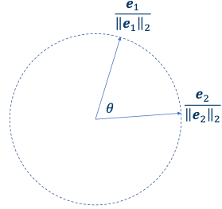
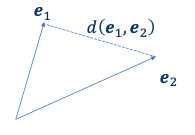
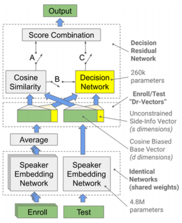
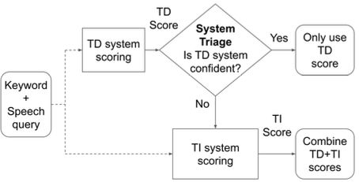
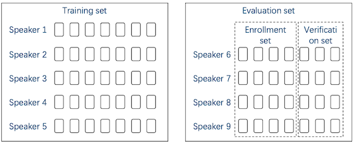
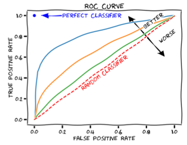
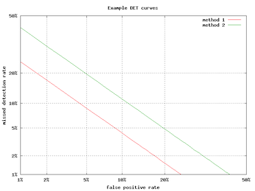
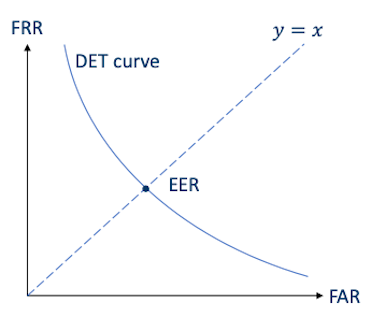
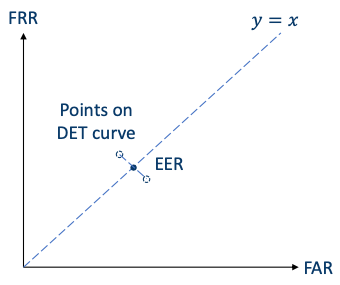
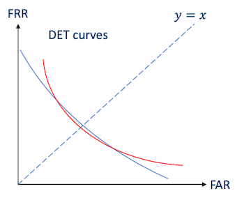

# Section 5: Fundamentals of Speaker Recognition

## 5.6 Similarity Score

앞서 utterance/speaker가 embedding vector로 표현되는 것을 살펴보았다. 그렇다면 두 embedding vector $e_1$ , $e_2$ 가 있다고 할 때, 벡터 사이의 **similarity**(유사도)는 어떻게 측정할 수 있을까? 

---

### 5.6.1 Cosine Similarity

대표적으로 **cosine similarity**를 사용하여 표현할 수 있다.

$$ \cos(e_1, e_2) = {{e_1 \cdot e_2} \over {||e_1||_2 \cdot ||e_2||_2}} $$

그림을 보며 살펴보자.



- $e_1$ , $e_2$ 가 동일한 원점을 가진다고 가정한다.

- $\theta$ : 두 벡터가 이루는 각도

  따라서 $\cos(e_1, e_2) = \cos \theta$ 이다.

이때 만약 N-dim case일 경우, L2-normalization을 거치면서 모든 embeddings가 **unit n-sphere**에 위치하게 된다.

- 결과는 cosine 값이므로 [-1, 1] 사이의 값이 된다.

- 결과가 클수록 더 similar하다고 볼 수 있다.

- extreme case

  - $\cos (e_1, e_2) = 1$ : 두 embeddings가 같은 line에 같은 방향으로 속해 있다.

  - $\cos (e_1, e_2) = 0$ : 두 embeddings가 직교한다.

  - $\cos (e_1, e_2) = 1$ : 두 embeddings가 같은 line에 있으나 서로 반대되는 방향이다.

---

### 5.6.2 Euclidean Distance

다른 방법으로 **Euclidean distance**을 사용할 수 있다.

$$ d(e_1 , e_2) = ||e_1 - e_2 ||_2 $$



- 결과값이 벡터가 가진 length에 의해 달라진다.

- 결과가 작을수록 더 similar하다고 볼 수 있다.

  따라서 역수를 취한 $d(e_1, e_2)^-1$ 을 similarity score로 사용한다.

---

### 5.6.3 Model-based similarity score

혹은 neural network를 기반으로 한 similarity score를 사용할 수 있다.

$$ f(e_1, e_2 | \theta) $$

- $f(\cdot)$ : neural network

  > **decision network**라고도 한다.

- $\theta$ : model이 가지는 parameters 집합

  > 따라서 training dataset을 이용한 학습이 필요하다.

---

### 5.6.4 Variants

> [Dr-Vectors: Decision Residual Networks and an Improved Loss for Speaker Recognition 논문(2021)](https://arxiv.org/abs/2104.01989)

이외에도 여러 방법이 있으며, 앞서 본 방법을 혼합해서 사용할 수도 있다. 예를 들어 Dr-Vectors 논문에서는 cosine similarity와 model-based score 방법을 혼합하여 similarity score를 계산한다.



이외에도 몇 가지 대표적인 variants가 있다.

- JHU variant (cosine similarity)

  두 가지 trainable parameters $S$ , $b$ 를 갖는다.

  > Probabilistic Linear Discriminant Analysis(PLDA) 방법에서 영감을 받았다.

  - $S$ : square matrix

  - $b$ : scalar

$$ L(e_1, e_2) = {e_1}^T e_2 - {e_1}^T e_2 - {e_2}^T S e_2 + b $$

- Mahalanobis distance (Euclidean distance)

$$ d(e_1, e_2) = \sqrt{(e_1 - e_2)^T S(e_1 - e_2)} $$

---

## 5.7 Thresholding

similarity score를 계산했다면, 이제 미리 정해둔 **threshold**를 바탕으로 decision을 내릴 수 있다. 

- Speaker Verification

  score $s$ , threshold $T$ 

  - $s \ge T$ : same speaker

  - $s < T$ : different speaker

- Speaker Identification

  runtime embedding을 바탕으로 여러 speaker candidates에서 구분해야 한다.

  따라서 multiple score를 가지며, 총 세 가지 가능성이 있다.

  - all scores < threshold: reject. imposter에 해당된다.

  - one score $\ge$ threshold: 해당 speaker로 판단한다.

  - multiple scores $\ge$ threshold: 해당 speaker 중에서 가장 높은 score를 갖는 speaker로 판단한다.

---

### 5.7.1 Multiple Threshold

하지만 decision이 꼭 Yes/No와 같은 binary일 필요는 없다. access level에 따라 여러 threshold를 두고 사용할 수도 있다.

- low threshold

  - 넘지 못할 경우: imposter로 확신(confident)한다. 모든 retry를 허락하지 않고 reject한다.

  - 넘을 경우: imposter일 수 있지만 확신할 수 없다. 따라서 retry를 허락한다.

- medium threshold

  - 넘을 경우: user일 가능성이 있지만 확신할 수 없다. 따라서 limited access를 허락한다.

- high threshold

  - 넘을 경우: user로 확신한다. accept와 sensitive information 접근을 허락한다.

- adaptative threshold

  만약 score가 threshold를 넘을 경우, 현재의 utterance를 speaker profile과 함께 re-enroll한다.

---

### 5.7.2 Cosine Similarity: Threshold-friendly score

cosine similarity score는 특성상 threshold-friendly하기 때문에 가장 보편적으로 사용된다.

- 실제 계산에서 score는 [0,1] 사이 값을 갖도록 조정해서 사용한다.

  - cosine similarity: 결과값이 [-1,1]에 속한다.

  - Euclidean distance: 결과값이 [0, $\infty$ )에 속한다.

    따라서 서로 다른 모델 사이의 threshold가 readable, comparable하지 않다.

---

## 5.8 Score Triaging

> [SpeakerStew: Scaling to Many Languages with a Triaged Multilingual Text-Dependent and Text-Independent Speaker Verification System 논문(2021)](https://arxiv.org/abs/2104.02125)

경우에 따라 score를 decision을 위해 사용하지 않고, 대신 **score triaging** 목적으로 사용할 수 있다. 예를 들어 여러 가지 모델을 가지고 있고, 어떤 모델은 비용이 저렴한 반면 다른 모델은 비용이 크다고 하자.

다음과 같은 triage strategy를 사용한다면 훨씬 비용을 절감하면서도 성능을 유지할 수 있다.



- Text-Dependent (small, cheap)

- Text-Independent (big, more accurate)

- small model(TD)이 high confidence를 갖는 경우: small model을 사용한다.

  - high confidence: cosine score가 1.0이나 0.0에 근접.

  - low confidence: cosine score가 0.5에 근접. 

- 그렇지 않을 경우: TD+TI combined result를 사용한다.

---

## 5.9 Evaluation

서로 다른 system이 있을 때 **evaluation**이 가능하다면, 어떤 system이 더 성능이 좋은지 구분할 수 있다.

- evaluation이 공정하기 위해서는 동일한 evaluation dataset이 필요하다.

  - 단, 특정 dataset에서 system A가 B보다 성능이 좋다고 해서, 다른 dataset에서도 성능이 우수할 것이라고 보장할 수 없다.

  - training dataset이 포함한 <U>utterances, speakers</U>와 overlap되서는 안 된다.

또한 evaluation은 크게 **Pair-based**, **Set-based** 두 가지 방법으로 나눌 수 있다.

---

### 5.9.1 Pair-based Evaluation

Pair-based evaluation이란 **trial pairs** 리스트를 정의해서 evaluation을 진행하는 방식이다.

- trial pair는 다음과 같은 요소를 포함한다.

  - two utterances

  - binary label: 두 utterances가 같은지(1), 다른지(0) 나타낸다.

예를 들어 VoxCeleb 데이터셋의 표준 trial pairs는 다음과 같은 형태이다.

```
• 1 id10270/x6uYqmx31kE/00001.wav id10270/8jEAjG6SegY/00008.wav
• 0 id10270/x6uYqmx31kE/00001.wav id10300/ize_eiCFEg0/00003.wav
```

---

### 5.9.2 Set-based Evaluation

하지만 실제 환경에서는 user가 multiple enrollment utterances를 가지고 있다. 따라서 이를 보완하기 위해 Set-based evaluation 방법을 사용한다.

- evaluation set

  두 subset으로 구분하여 각 speaker마다 갖는 다른 utterances를 보완한다.

  

  - enrollment set

  - verification set

이러한 set-based evaluation은 두 단계로 수행된다.

1. enrollment set을 바탕으로 모든 speaker를 등록한다.

2. verification set의 utterence를 1에서 등록한 speaker와 비교한다.

   - same speaker: **positive** sample

   - different speaker: **negative** sample

그런데 verification set에서, positive samples보다 negative samples 비율이 더 많을 수밖에 없다. 따라서 **subsample**을 통해 positive, negative sample의 비율을 맞추는 경우가 많다.

---

## 5.10 Errors: False Accept, False Reject

utterance-vs-utterance 혹은 utterance-vs-speaker trial에 있어서 결과는 네 가지 종류로 분류할 수 있다.

| 실제 정답 | 예측 | Error |
| --- | --- | --- |
| same speaker | same | True Accept (TA) |
| same speaker | different | **False Reject** (FR)<br/>= Type II Error |
| different speaker | same | **False Accept** (FA)<br/>= Type I Error |
| different speaker | different | True Reject (TR) |

두 종류의 오답이 발생하지 않을수록 system이 좋은 성능을 갖는다.

- False Accept Rate(FAR)

  false speaker를 accept할 가능성.

$$ \mathrm{FAR} = {{\mathrm{FA}} \over {\mathrm{FA + TR}}} $$

- False Reject Rate(FRR)

  true speaker를 reject할 가능성.

$$ \mathrm{FRR} = {{\mathrm{FR}} \over {\mathrm{FR + TA}}} $$

---

### 5.10.1 Errors and Threshold

이러한 errors가 발생하는 비율은 similarity score의 **threshold**(=**operating point**)에 따라서 바뀌게 된다.

- threshold를 늘릴 경우

  - True Accept(TA) 비율이 줄어든다.

  - True Reject(TR) 비율은 늘어난다.

이처럼 threshold에 따라 FAR, FRR이 바뀌는 탓에, 다른 system을 비교할 때 그대로 FAR, FRR을 사용해서 성능을 비교할 수 없다. 

---

### 5.10.2 Receiver Operation Characteristic(ROC) curve

따라서 서로 다른 system을 비교하기 위해서는 **threshold-independent** metrics가 필요하다. **Receiver Operation Characteristic**(ROC) curve는 threshold 값의 범위를 고정하여 서로 다른 system을 분석한다.(예: [0,1])



- x축: False Accept Rate

- y축: True Accept Rate

- 대각선에 해당되는 직선: 50:50 random guess 성능을 의미한다.

- 좌측 상단에 가까울수록 system 성능이 좋다.

ROC curve를 정량적으로 계산하기 위해 주로 사용하는 방법으로는, curve 아래 면적을 계산하는 **Area Under Curve**(AUC)가 있다.

- AUC가 클수록 system 성능이 좋다.

- [0,1] 사이 값을 갖는다.

> 단, AUC는 implementation과 resolution에 굉장히 sensitive하므로 주의해야 한다.

---

### 5.10.3 Detection Error Tradeoff(DET) curve

하지만 speaker recognition에서는 ROC curve보다도 **Detection Error Tradeoff**(DET) curve를 더 많이 사용한다.



- x축: FAR

- y축: FRR

- 좌측 하단에 가까울수록 system 성능이 좋다.

> linear하게 표시하기 위해서 대체로 log-scale을 사용한다.

이때 DET curve에서 y=x 직선을 긋는다면, FAR=FRR이 되는 **Equal Error Rate**(EER) 지점이 된다.



- 해당 지점에서의 threshold를 **EER threshold**라고 한다.

- EER이 작을수록 system 성능이 좋다.

---

#### 5.10.3.1 Computing EER

EER의 정의는 직관적이지만, 실제 계산을 통해 EER을 구하는 것은 쉽지 않다. 계산은 다음과 같은 과정으로 진행된다.



- FAR과 FRR의 값이 근접한 두 지점을 고른다.

  이때 binary search 방법을 사용해서 찾는다.

- 두 지점을 이은 직선과, y=x 직선과의 교점을 찾는다.

---

#### 5.10.3.2 Interpreting EER

그렇다면 이렇게 찾아낸 EER은 어떻게 해석해야 할까? 먼저 operating point를 EER threshold로 둔다고 가정하고 두 예시를 살펴보자.

- all trials = positive trials(same speaker)일 경우

  "FRR $\approx$ EER, FAR = 0"이 된다.

- all trials = negative trials(different speaker)일 경우

  "FAR $\approx$ EER, FRR = 0"이 된다.

EER은 충분히 total error rate의 근사값으로 사용할 수 있다. 하지만 몇몇 특수한 경우에서는 total error rate의 근사값으로 EER을 사용한다면 잘못된 비교를 저지를 수 있다.



- 빨간색 DET curve의 EER < 파란색 DET curve의 EER

- 하지만 대부분의 지점에서 파란색 DET curve가 원점과 더 가깝기 때문에 성능이 더 좋다.

---

### 5.10.4 Minimun Detection Cost Function(minDCF)

또 다른 대표적인 metric으로는 **Minimun Detection Cost Function**(minDCF)가 있다. 특히 다른 application 간의 비교에서 많이 사용된다.

- 다른 apllications일 경우, error type마다의 tolerance level이 서로 다를 수 있다.

  예를 들어 security applications에서는 FA의 위험이 크지만, wake-up application은 FR의 위험이 크다.

우선 Detection Cost Function(DCF)의 수식은, FRR, FAR별 갖는 cost를 고려하여 다음과 같이 정의된다.

$$ C_{Det} = C_{FR} \cdot \mathrm{FRR} \cdot P_T + C_{FA} \cdot FAR \cdot P_I $$

- $C_{Det}$ : detection cost function

- $C_{FR}$ : FR cost

- $C_{FA}$ : FA cost

- $P_T$ : prior probability of true speaker

- $P_I$ : prior probability of false speaker(imposter)

여기서 minDCF는 $C_{Det}$ 가 최소값을 갖는 threshold를 찾는다.

> 이때 security에서는 $C_{FA}$ 를 크게 설정하고, wake-up에서는 $C_{FR}$ 을 크게 설정한다.

---

## 5.11 Identification accuracy

앞서 EER/AUC/minDCF는 speaker verification에서 사용하는 metric이었다. speaker identification에서는 주로 identification accuracy를 metric으로 사용한다.

- utterence-vs-speaker trial pairs 대신 $(k+1)$ tuples를 사용한다.

  - evaluate할 utterance를 포함한다.

  - (true speaker 포함) $k$ different enrolled speakers를 갖는다.

- 해당 utterance를 $k$ speakers 중에서 true speaker에게 가장 높은 score를 매길수록 identification accuracy가 높다.

  > 대체로 $k$ 를 크게 잡을수록 accuracy가 낮아진다.

---

## 5.12 Summary of metrics

다음은 metric의 dependency를 정리한 도표다. 이중에서는 EER이 다른 요인에 영향을 받지 않기 떄문에 가장 보편적으로 사용된다.

| Metrics | Depends on |
| --- | --- |
| FAR / FRR | threshold |
| Area under ROC curve(AUC) | Resolution of threshold / implementation details |
| Equal Error Rate(EER) | - |
| DCF | threshold, costs of FA/FR, prior probabilities of true/false speaker |
| minDCF | costs of FA/FR, prior probabilities of true/false speaker |
| Identification accuracy | number of candidate speakers $k$ |

---
