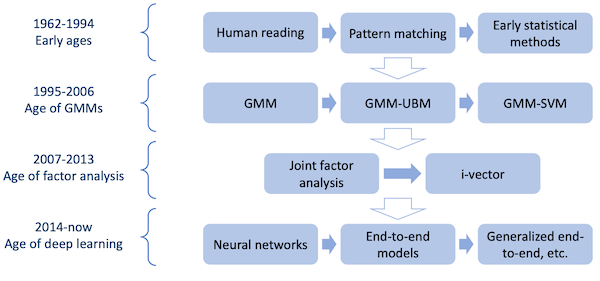
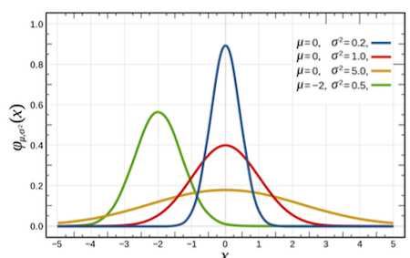
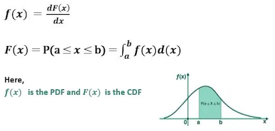
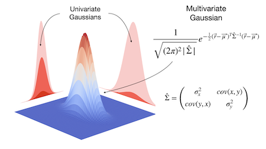
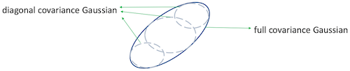
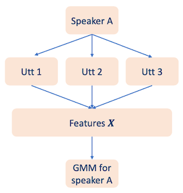
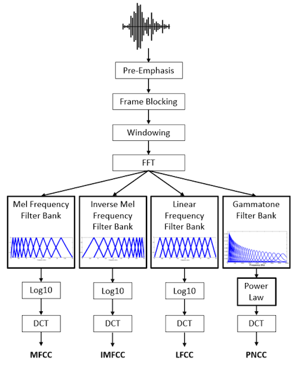
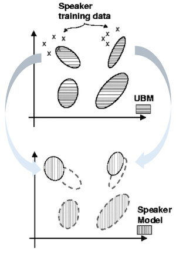
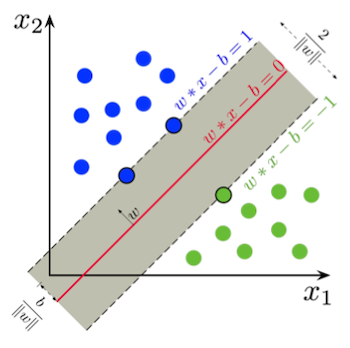
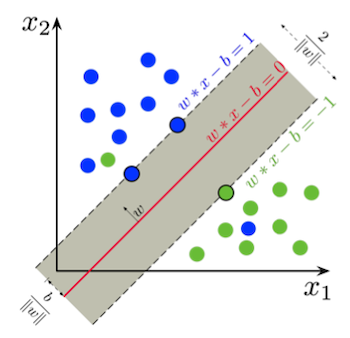

# Section 6: Early Speaker Recognition Approaches

이번 Section에서는 voice identification 도메인의 딥러닝 부상 전(1995~2013)에 사용된 기술을 살펴볼 것이다.



## 6.1 Gaussian Distribution

> [First Principles of Computer Vision youtube: Gaussian Mixture Model | Object Tracking](https://youtu.be/0nz8JMyFF14): 비전 도메인에서의 응용

배경 지식으로 **Normal Distribution**(정규 분포) 혹은 **Gaussian Distribution**(가우시안 분포)로 불리는 연속 확률 분포를 살펴보자.

> 가우시안 분포는 단순하고 흔할 뿐더러, **Central Limit Theorem**(CLT, 중심극한정리)에 따르면 다른 분포를 가우시안 분포로 쉽게 근사할 수 있다.



> 주로 $x \sim N(x|\mu , {\sigma}^2)$ 로 표현한다.

- $\mu$ : mean

- $\sigma$ : standard deviation

- ${\sigma}^2$ : variance

그렇다면 Cumulative Distribution Function(CDF, 누적 분포 함수)의 도함수에 해당되는 **Probability Density Function**(PDF, 확률 밀도 함수)는 어떻게 정의될까?



- Gaussian Distribution에서의 PDF는 다음과 같이 정의한다.

```math
p(x) = {{1} \over {\sqrt{2 \pi} \sigma}} e^{-{{1} \over {2}}({{x - \mu} \over {\sigma}})^2}
```

---

### 6.1.1 Multivariate Gaussian Distribution

> [다변량 확률변수란?](https://ilovedata.github.io/teaching/linearmodel-grad/_book/mulivar.html)

> [HashPi: Visualizing a multivariate Gaussian](https://www.hashpi.com/visualizing-a-multivariate-gaussian)

$K$ 차원의 확률 변수 $x$ 가 있을 때의, **Multivariate Gaussian Distribution**(다변량 가우시안 분포, 다변량 정규분포)을 살펴보자.



> 주로 $x \sim N(x|\mu, \Sigma)$ 로 표현한다.

- $x$ : $K$ 차원 random vector

- $\mu$ : $K$ 차원 mean vector

- $\Sigma$ : $K \times K$ covariance matrix(공분산 행렬)

Probability density function은 다음과 같이 정의한다.

```math
p(x) = {{1} \over {\sqrt{(2 \pi)^K | \Sigma |} }} e^{-{{1} \over {2}}{{(x - \mu)^T} {\Sigma}^{-1}(x-\mu)}}
```

---

### 6.1.2 Why Gaussian Distribution?

그렇다면 speaker recognition에서는 무엇을 Gaussian Distribution으로 나타낼 수 있을까?

- 특정 word/phoneme의 Fundamental frequency

- Formants

- Intensity

- Signal-to-noise ratio

- Length of a word/phoneme

---

## 6.2 Gaussian Mixture Model

**Gaussian Mixture Model**(GMM)의 핵심은, 어떠한 complicated distribution을 $M$ 개의 Gaussian distribution의 weighted sum으로 표현될 수 있다는 아이디어이다.


PDF는 다음과 같이 여러 Gaussian distribution의 합산으로 표현된다.

$$ p(x) = \sum_{i=1}^{M} c_i \cdot N_i (x) $$

- $c_i \ge 0$ : $i$ 번째 Gaussian distribution의 weight

- $\sum_{i=1}^{M} c_i = 1$ : weight의 총합은 1이다.

- Gaussian $N_i (x)$

```math
N_i (x) = {{1} \over {\sqrt{(2 \pi)^K | {\Sigma}_i |} }} e^{-{{1} \over {2}}{{(x - {\mu}_i)^T} {\Sigma}_i^{-1}(x-{\mu}_i)}}
```

이때 모든 패러미터를 포함하는 parameter set $\lambda$ 를 다음과 같이 정의한다.

$$ \lambda =  \lbrace c_i , {\mu}_i , {\Sigma}_i ; i = 1, 2, ..., M \rbrace $$

---

### 6.2.1 Covariance matrix

$\lambda$ 가 갖는 총 패러미터 개수를 알아보자.

$$ \lambda =  \lbrace c_i , {\mu}_i , {\Sigma}_i ; i = 1, 2, ..., M \rbrace $$

- $c$ : real number $M$ 개

- ${\mu}$ : $K$ 차원 vector $M$ 개 

- ${\Sigma}$ : $K \times K$ matrix $M$ 개

- 따라서 총 \#parameters는 $M \cdot(1+K+K^2)$ 이다. 

그런데 $K$ 가 크면 클수록 covariance matrix가 갖는 원소의 개수가 기하급수적으로 증가하게 되고, 따라서 **overfitting**을 유발할 수 있다. parameter explosion을 막기 위해서 다음과 같은 테크닉을 사용한다.

- **Sharing** covariance matrix

  - 각 speaker의 모든 components가 동일한 covariance matrix를 갖게 한다.

  - 모든 speaker의 모든 components가 동일한 covariance matrix를 갖게 한다.

- **Simpler** covariance matrix

  - $K \times K$ full covariance matrix 대신 **diagonal** covariance matrix를 사용한다.

    > 보통 각 speaker의 각 component마다 자신만의 diagonal covariance matrix를 갖도록 사용한다.

    $\rightarrow$ 행렬의 패러미터 수가 $K$ 개로 줄어들게 된다.

---

### 6.2.2 Diagonal Covariance Matrix

하나의 covariance Gaussian은 여러 개의 diagonal covariance Gaussian의 sum으로 표현할 수 있다.



diagonal covariance matrix의 총 패러미터 수는 다음과 같다.

$$ \lambda =  \lbrace c_i , {\mu}_i , {\sigma}_i ; i = 1, 2, ..., M \rbrace $$

- \#parameters: $M \cdot (1 + 2K)$

이때 distribution을 표현하는 식은 다음과 같이 바뀐다.

$$ N_i(x) = \prod_{k=1}^{K} {{1} \over {\sqrt{2\pi} {\sigma}_{ik}}}e^{- {{1} \over {2{\sigma}_{ik}^2}}(x_k - {\mu}_{ik})^2} $$

---

## 6.3 GMM for speaker modeling

Speaker Recognition에서 GMM을 이용해 speaker model를 구하는 과정은 다음과 같다.



먼저 speaker A의 여러 utterance에서 acoustic feature를 추출한다.

  

  > acoustic features: PLP, MFCC, LFBE 등

다음은 GMM의 parameter set $\lambda$ 를 **Maximum Likelihood Estimation**(MLE)을 사용하여 추정한다.이 과정을 **parameter estimation**라고 하며, 다음 식에서 결과를 maximize하는 parameter set $\lambda$ 를 찾는다.

$$ p(X|\lambda) = \prod_{n=1}^{N} p(x_n|\lambda) $$

- features $X$

  내가 가진 데이터셋에 해당된다. $X$ 는 서로 independent하다.

$$ X = (x_1, x_2, \cdots , x_N) $$

> utterance의 길이, speaker 수, speaker model의 크기(Gaussian component 수)에 따라 계산량이 기하급수적으로 증가할 수 있다.

---

### 6.3.1 Expectation-Maximization Algorithm

이때 MLE를 풀기 위해서 **Expectation-Maximization**(EM) Algorithm을 사용한다.

1. Initialize $\lambda$

   random initialization 혹은 K-means clustering을 사용하여 패러미터를 ${\lambda}_0$ 로 초기화한다.

   > 이때 각 cluster는 multivariate Gaussian distribution으로 표현된다.

2. E-step

   iteration $t$ 에서의 parameter set ${\lambda}^{t-1}$ 이 있다고 하자. 각 sample $x_n$ 과 $i$ 번째 component 사이의 'membership values'는 다음과 같이 계산할 수 있다.

$$ p(i|x_n,{\lambda}^{(t-1)}) = {{{c}_i^{(t-1)} \cdot N_{i}^{(t-1)}(x_n)} \over {{\sum}_{j=1}^{M}c_j^{(t-1)}\cdot N_{j}^{(t-1)}(x_n)}} $$

3. M-step
 
   - membership values를 바탕으로, iteration $t$ 에서의 weights를 update한다.
   
   - iteration $t$ 에서의 mean, diagonal covariance matrix를 update한다.

$$ c_i^{(t)} = {1 \over N}{\sum}_{n=1}^N p(i|x_n , {\lambda}^{(t-1)}) $$

$$ {\mu}_i^{(t)} = {{\sum_{n=1}^{N}p(i|x_n,{\lambda}^{(t-1)}) \cdot x_n} \over {\sum_{n=1}^{N}p(i|x_n, {\lambda}^{(t-1)})}} $$

$$ ({\sigma}_{ik}^{2})^{(t)} = {{\sum_{n=1}^{N}p(i|x_n,{\lambda}^{(t-1)}) \cdot (x_{nk} - {\mu}_{nk})^2} \over {\sum_{n=1}^{N}p(i|x_n, {\lambda}^{(t-1)})}} $$

4. 2(E-step), 3(M-step)을 반복한다.

   종료는 (1) 정해둔 iteration 최대치에 도달하거나, (2) 이전 iteration과의 차이가 정해둔 threshold보다 작을 때를 기준으로 한다.

---

### 6.3.2 Singularities

하지만 parameter estimation 과정에서 **singularities** 문제를 주의해야 한다.

- ${\sigma}_{ik}^2$ 가 매우 작은 값을 갖는다면, Gaussian 계산에서 overflow가 발생할 수 있다.

따라서 singularities를 피하기 위해 다음과 같은 테크닉을 사용한다.

- **Flooring** : ${\sigma}_{ik}^2$ 의 최소값을 정해준다.

- **Variance Clamping** : ${\sigma}_{ik}^2$ 의 최대값을 정해준다.

---

### 6.3.3 Speaker Identification with GMM

이처럼 parameter estimation을 거치면 $S$ 명의 candidate speakers를 GMM model로 표현할 수 있다. 이때 각 candidate speaker의 GMM paramters는 ${\lambda}_1, {\lambda}_2, \cdots, {\lambda}_S$ 가 된다.

이제 새로운 acoustic feature $X$ 가 주어졌을 때, 이 feature가 어떤 candidate speaker의 것인지를 판별해야 한다. (**speaker identification**)

- $S$ candidate speaker의 prior probabilities(사전 확률)가 동일하다고 가정할 때, best speaker는 다음과 같이 표현할 수 있다.

$$ s^{*} = \arg \max_{1 \le s \le S} \ln p(X|{\lambda}_s) $$

$$ \quad \quad = \arg \max_{1 \le s \le S} \sum_{n=1}^{N} \ln p(x_n|{\lambda}_s) $$

---

## 6.4 Universal Background Model

하지만 위와 같은 방법은 **closed set** speaker identification에서 정의한 것으로, **open set** speaker identification에서는 활용할 수 없다.

- imposters가 있을 수 있다.

- Log-likelihood를 사용할 수 없다.

- 모든 speaker의 GMM를 구하기 위해, 너무 많은 parameter estimation 연산이 필요할 수 있다.

  > 또한 몇몇 speaker에게는 충분한 data가 없을 수 있다.

따라서 이러한 문제를 해결하기 위해 alternative speakers, imposters를 표현할 수 있는 speaker-independent GMM을 사용한다. 이를 **Universal Background Model**(UBM)이라고 지칭한다. UBM은 모든 speaker가 활용할 수 있는 범용적인 모델이다.

UBM을 사용하는 speaker recognition 문제는 **hypothesis testing problem**로 정의한다. 먼저 다음과 같이 두 가지 hypothesis를 정의해 보자.

- $H_0$ : speaker $S$ 의 utterance로 가정

- $H_1$ : speaker $S$ 가 아닌 다른 speaker의 utterance로 가정

이때 Log-likelihood ratio는 다음과 같이 표현할 수 있다다.

$$ L(X) = \ln p(X|\lambda) - \ln p(X|{\lambda}_{H1}) $$

- $\ln p(X|\lambda)$ : speaker $S$ 의 GMM

- $\ln p(X|{\lambda}_{H1})$ : GMM-UBM

- 판단은 다음과 같이 이루어진다.

  - $L(X) > 0$ 일 경우: $H_0$ accept

  - otherwise: $H_1$ accept

UBM은 GMM과 마찬가지로 EM algorithm을 사용하여 parameter estimation을 수행할 수 있다. 이때 다음과 같은 문제를 해결하기 위해 모든 speaker의 training data를 pooling(하나로 결합)하여 수행한다.

- training 중에는 imposter data가 없다.

- UBM은 반드시 **speaker-independent**해야 한다.

---

### 6.4.1 Bayesian Adaptation

GMM-UBM 모델을 획득했다면 individual speaker의 GMM을 추정할 수 있다. 하지만 이때 speaker의 GMM을 직접 추정하지 않고, 대신 모델의 패러미터를 **Bayesian adaptation**을 사용하여 각 speaker data에 adapt시키는 방법으로 구한다.



- 모든 GMM은 동일한 UBM을 사용하여 adaptation한다.

- adaptation은 insufficient data만으로도 가능하다.

---

#### 6.4.1.1 Different adaptation strategies

Bayesian adaptation을 적용할 때, weight, means, covariances의 adapt/freeze 여부를 결정해야 한다.

- adapt everything(weights, means, covariances)

- adapt weights / freeze means, covariances

- adapt means, covariances / freeze weights

- adapt means / freeze weights, covariances

이 중에서 4번째가 가장 optimal한 방법이다. 또한 모든 components가 갖는 means를 하나의 벡터로 결합하여 표현하는 경우가 많은데, 이러한 concatenated vector를 **supervector**라고 한다.

### <span style='background-color: #393E46; color: #F7F7F7'>&nbsp;&nbsp;&nbsp;📝 예제 1: supervector 차원 구하기 &nbsp;&nbsp;&nbsp;</span>

하지만 주의할 점은 supervector가 갖는 **dimensionality**가 너무 클 수 있다. 다음 예시에서 supervector가 갖는 차원을 구하라.

- acoustic feature: 39차원 MFCC

- GMM: 512개 components

### <span style='background-color: #C2B2B2; color: #F7F7F7'>&nbsp;&nbsp;&nbsp;🔍 풀이&nbsp;&nbsp;&nbsp;</span>

supervector가 갖는 차원은 당므과 같다.

$$39 \times 512 = 19,968$$

또한 supervector는 speaker의 다른 information, 예를 들어 microphone, acoustic environment(room reverberation 등), background noise 등을 포함할 수 있으므로 주의해야 한다.

---

### 6.4.2 training workflow

GMM-UBM을 이용한 speaker model의 training workflow을 요약하면 다음과 같다.


1. speaker-independent한 UBM을 훈련한다.

2. 각 speaker의 feature data를 가지고, Bayesian adaptation을 통해 각 speaker의 GMM을 구한다.

---

## 6.5 Support Vector Machine(SVM)

**Support Vector Machine**(SVM)은 classification, regression 등 많은 분야에서 사용되는 대표적인 기계학습 방법 중 하나이다. 특히 딥러닝 모델의 부상 전, speaker recognition에서 GMM-SVM이 굉장히 많이 사용되었다.

SVM은 **maximum-margin** principle을 기반으로 한다. 예를 들어 다음과 같은 binary classification 데이터셋이 있다고 하자.

$$ \lbrace(x_1, y_1), ..., (x_N, y_N)\rbrace $$

- $x_i$ : feature vector

- $y_i \in \lbrace -1, 1 \rbrace$ ; binary ground truth label

목표는 $y_i = 1$ , $y_i = -1$ 을 구분하는 hyperplane $w \cdot x - b$ 를 찾는 것이다. 동시에 margin은 최대화해야 한다.



> 파란색 점: data = 1 / 초록색 점: data = -1 / 직선: hyperplane

- hyperplane에 위치한 점을 **support vector**라고 지칭한다.

- margin : ${{2} \over {||w||}}$

  따라서 margin을 최대화하려면 norm $||w||$ 를 최소화해야 한다.

  > 이때 line과 가장 가까운 파란색 점, 초록색 점과의 거리는 일치한다.

- constraint는 다음과 같이 표현할 수 있다.

$$ y_i \cdot (w \cdot x_i - b) \ge 1 $$

---

### 6.5.2 Linear SVM with soft margin

하지만 언제나 두 class가 linearly seperable하다는 보장은 없다. 따라서 어느 정도의 오차를 허용하는 **soft-margin**을 도입한다. 이때 주로 사용하는 손실 함수가 **hinge loss**이다. 기본적으로 두 가지를 최소화하는 것을 목표로 한다.

- classification error (hinge loss)

- margin size

다음 soft margin을 사용하는 linear SVM 예시 그림을 살펴보자.



- hinge loss

$$ \max(0, 1 - y_i \cdot (w \cdot x_i - b)) $$

- soft-margin SVM

  - $\lambda$ : 두 targets 사이의 tradeoff를 조절하는 패러미터

$$ {\min}_{w,b} \left ( \left ({1 \over N}\sum_{i=1}^{N}\max(0, 1 - y_i \cdot (w \cdot x_i - b))\right) + \lambda || w ||^2 \right) $$

이때 문제를 $w$ 와 $b$ 를 최적화하는 문제로 볼 수 있다. 새로운 데이터 $x$ 를 입력으로 주면서 scoring function을 계산해 나간다.

$$ g(x) = w \cdot x - b $$

---

## 6.6 Non-linear SVM

하지만 실제 응용에서는 linear classification을 적용할 만큼 feature space가 이상적인 경우는 적다. 따라서 먼저 feature space에 적용할 **non-linear transform** $\phi (\cdot)$ 을 찾아야 한다. Non-linear SVM은 다음과 같은 과정으로 진행된다.

- 모든 feature $x$ 를 $\phi (x)$ 로 변환한다.

- $\phi (x)$ 에 linear SVM을 적용한다.

---

### 6.6.1 Kernel trick

**kernel trick**을 이용하면 non-linear transform $\phi (\cdot)$ 를 찾을 필요 없이, **kernel function**만을 정의해서 연산을 수행할 수 있다. 

- kernel function

$$ K(x_1, x_2) = \phi (x_1)^T \phi (x_2) $$

- scoring function

  - $\alpha$ : 거의 대부분의 경우에서 0이며, support vector에 해당하는 경우에만 0이 아닌 값을 갖는다. (training 과정을 통해 구한다.)

$$ g(x) = \left( \sum_{i=1}^{N} {\alpha}_i y_i K(x, x_i) \right) + b $$

---

### 6.6.2 Commonly used kernel functions

주로 사용하는 kernel functions으로는 다음과 같은 종류가 있다.

- Degree-d polynomial kernel

$$ K(x_1, x_2) = (x_1 \cdot x_2 + 1)^d $$

- Degree-d homogeneous polynomial kernel

$$ K(x_1, x_2) = (x_1  \cdot x_2)^d $$

- Radial Basis Function(RBF) kernel $( \gamma > 0)$

  > 가장 보편적으로 사용하는 kernel function이다.

$$ K(x_1, x_2) = \exp(- \gamma ||x_1 - x_2||^2) $$

- Hyperbolic tangent kernel ( $\kappa > 0, c < 0$ )

$$ K(x_1, x_2) = \tanh (-\kappa x_1 \cdot x_2 + c) $$

---

## 6.7 Kernel functions for speaker recognition

### 6.7.1 GMM supervector linera kernel

앞서 GMM-UBM에서 구한 supervector를 사용하여, kernel function으로 다음과 같은 linear kernel을 정의할 수 있다.

$$ K(U_a, U_b) = \sum_{i=1}^{M} c_i ({\mu}_i^a)^T {\Sigma}_i^{-1} {\mu}_i^b $$

- $\lbrace {\mu}_i^{a} \rbrace$ , $\lbrace {\mu}_i^{b} \rbrace$  : 두 utterance $U_a$ , $U_b$ 가 주어졌을 때의 각 adapted means

- $\lbrace c_i \rbrace$ , $\lbrace {\Sigma}_i \rbrace$ : UVM의 weights, covariances

---

### 6.7.2 GMM L2 inner product kernel

GMM supervector linear kernel보다 성능은 좋지 않으나 다음과 같이 kernel function을 정의할 수도 있다.

> original GMM-UBM보다는 훨씬 좋은 성능을 갖는다.

$$ K(U_a, U_b) = \sum_{i=1}^{M} \sum_{j=1}^{M} c_i c_j N({\mu}_i^a - {\mu}_j^b | 0, {\Sigma}_i + {\Sigma}_j) $$

---

## 6.8 Workflow of GMM-SVM

GMM-SVM의 workflow를 요약하면 다음과 같다.

1. 먼저 UBM을 구한다.

2. 각 <U>utterance</U>를 가지고 adapt시킨다.

3. kernel function을 사용해 (speaker를 분류하는) non-linear SVM classifier를 학습한다.

여기서 GMM-UBM과 가장 큰 차이점은 두 가지를 들 수 있다.

- GMM을 speaker가 아닌 utterance를 나타내기 위해 사용한다.

- 각 speaker는 SVM classifier를 통해 구분된다.

---
