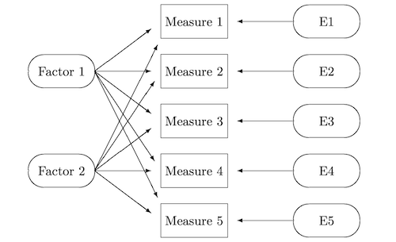

# Section 6: Early Speaker Recognition Approaches

## 6.9 Factor Analysis

소수의 **factor**(요인)을 추출하여 변수들 사이의 공통점을 찾아내는 **Factor Analysis**(요인 분석) 방법을 알아보자.

- observed, correlated variables의 variability(밀집 혹은 분산되어 있는 정도)를 나타낼 수 있다.

  예: 10개의 시험에서 받은 점수는 observed variable이다.

- **unobserved**, **uncorelated** variables를 추정할 수 있다. 이를 **factors**라고 한다.

  예: 지능이나 노력과 같은 부분은 unobserved variable(factor)이다.

더 나아가 factor는 **common factor**(공통요인) $f$ 와 unique factor(고유요인) $\epsilon$ 으로 나뉜다.



---

### 6.9.1 Common factor

Factor analysis에서 deviation(편차)은 다음과 같이 표현한다.

```math
x_i - {\mu}_i = l_{i1}f_1 + \cdots + l_{ik}f_k + {\epsilon}_i
```

- $x_i$ : $p$ 개 임의의 변수 중 $i$ 번째 변수

  평균값으로 ${\mu}_i$ 를 갖는다.

- $f_1, \cdots , f_k$ : $k$ 개 **common factors** 

  이때 $k < p$ 를 만족한다.(factors의 개수 < 변수의 개수)

- ${\epsilon}_i$ : unobserved stochastic error term

  **평균은 0**이며 유한한 분산값을 갖는다.

---

### 6.9.2 Loading matrix

$p$ 개 임의의 변수를 합쳐서 vector $x$ 로 두면, 식은 다음과 같이 표현할 수 있다. 이때 아래의 $L$ 행렬을 **loading matrix**라고 지칭한다.

$$ x - \mu = Lf + \epsilon $$

따라서 $N$ observations $x_i$ 가 있다고 하면, loading matrix를 이용해 다음과 같이 나타낼 수 있다.

$$ x_i - \mu = Lf_i + {\epsilon}_i $$

- $\mu$ , $L$ : observation independent

- $f_i$ , ${\epsilon}_i$ : 각 observation마다 해당하는 값을 갖는다.

위 Factor analysis에서 사용하는 가정은 총 세 가지다.

1. $f_i$ , ${\epsilon}_i$ 는 서로 independent하다.

2. $f_i$ 는 zero expectation을 갖는다.

    > 확률 변수의 expectation: 확률 사건의 평균값, 사건이 일어나서 얻는 값과 사건이 일어날 확률을 곱한 값을 모든 사건에 대해 합한 값

$$ \mathbb{E}(f_i) = 0 $$

3. $f_i$ 의 covariance는 identity matrix이다.

$$ \mathrm{cov}(f_i) = I $$

---

## 6.10 Joint Factor Analysis

**Joint Factor Analysis(JFA)** 는 Factor Analysis를 GMM-UBM에 적용한 방법이다. 다음과 같은 GMM-UBM 모델이 있다고 하자.

> speakers와 channels의 factors를 동시에 분석하기 때문에 joint라는 단어가 붙었다. 

- GMM: $M$ components, $K$ feature dimensions

- supervector $s$ : $MK \times 1$ 차원을 갖는다.

이때 JFA는 다음과 같은 식으로 나타낸다.

$$ s = m + Vy + Ux + Dz $$

- $m$ : $MK \times 1$ 차원의 **speaker-independent** supervector

  UBM의 supervector를 바로 대입할 수 있다.

- $y$ : low-dimensional **speaker factors**

  - 표준 정규 분포 $N(0, I)$ 을 따른다.

  - $V$ : $y$ 의 Loading matrix. 
  
     > 각 column을 **eigenspeaker**로 부른다.

- $x$ : low-dimensional **channel factors**

  - 표준 정규 분포 $N(0, I)$ 을 따른다.

  - $U$ : $x$ 의 loading matrix

    > 각 column을 **eigenchannel**로 부른다.

- $z$ : $MK \times 1$ 차원의 speaker dependent **residual** (common factors)

    - 표준 정규 분포 $N(0, I)$ 을 따른다.
    
    - $D$ : $MK \times MK$ 차원을 갖는 $z$ 의 loading matrix

위 loading matrix $V, U, D$ 를 추정하기 위해서는 수많은 방정식을 풀어야 한다는 단점이 있다.

---

### 6.10.1 JFA for speaker recognition

일단 speaker factors $y$ 를 구하면, $y$ 를 kernel function에 대입하여 사용할 수 있다. 이러한 방법을 **JFA-SVM**이라고 한다. 그런데 JFA를 통해 얻어낸 channel factor $x$ 가 speaker information을 포함하지 않는다고 가정했지만, 실제로는 그렇지 않다.

- 이상적인 경우, speaker classification의 EER이 ~50%에 근접한다. 

- 하지만 $x$ 는 여전히 speaker information을 많이 포함하기 떄문에, EER이 20%보다 낮은 수치를 보인다.

$y$ 만 쓸 경우 $x$ 에 포함된 유용한 정보를 모두 잃어버리게 된다. 이러한 배경에서 speaker, channel factor를 구분하지 않는 i-vector가 등장하게 된다.

---

## 6.11 i-vector

**i-vector**는 마찬가지로 Factor Analysis를 기반으로 하는 방법으로, JFA의 단점을 고려하여 단순화시킨 버전이다. 배경이 된 아이디어는 다음과 같다.

- speaker factor와 channel factor를 구분하지 않는다.

  channel space $U$ , speaker space $V$ 를 합친다.

- 대신 **total variability** space $T$ 와 **total factors** $w$ 를 사용한다.

i-vector의 factor analysis equation을 살펴보자.

$$ s = m + Tw $$

- $m$ : speaker-independent, channel-independent supervector

  UBM의 supervector를 바로 대입하여 사용할 수 있다.

- $w$ : $N(0, I)$ 를 따르는 total factors

  > 이를 i-vector 혹은 identity vector로 지칭하기도 한다. 보통 400~600 차원을 갖는다.

또한 위 방정식을 다음과 같은 성질을 갖는 것으로 해석할 수 있다.

- $s$ 는 multivariate normal distribution(다변량 정규 분포)을 따른다.

  이때 평균은 $m$ , 분산은  $TT^{T}$ 이다.

참고로 total variability space $T$ 는 JFA에서 speaker factor $V$ 를 구하는 방법과 유사하다.

---

### 6.11.1 Channel compensation

speaker, channel information을 모두 가진 total factors $w$ 를 speaker recognition에서 바로 사용할 수 없다. 따라서 추가로 **channel compensation** 과정을 거쳐야 한다.

- **projection matrix** $A$ 를 찾는다.

- $A$ 를 $w$ 에 곱하여 **channel compensated i-vector** $w' = Aw$ 를 구한다.

  결과는 channel information을 포함하지 않는다. 이렇게 구한 $w'$ 를 speaker recognition에 사용한다.

아래는 channel compensation으로 쓰이는 대표적인 네 가지 방법이다.

- Within-class covariance normalization(WCCN)

- Linear discriminant analysis(LDA)

- Nuisance attribute projection(NAP)

- Probabilistic linear discriminant analysis(PLDA)

---

### 6.11.2 Speaker recognition with i-vector

i-vector를 이용한 cosine similarity는 다음과 같이 계산할 수 있다.

$$ \cos (w_1, w_2) = {{w_1^T w_2} \over {||w_1|| \cdot ||w_2||}} $$

- $w_1$ , $w_2$ : 두 utterances의 각 channel compensated i-vector

이렇게 구한 cosine similarity는 speaker recognition을 수행하기 위한 threshold로 사용하거나, SVM의 cosine kernel function $K(w_1 , w_2) = \cos (w_1, w_2)$ 으로 사용할 수 있다.


---

## 6.13 JFA vs i-vector

요약하자면 두 방법은 모두 Factor Analysis 기반이지만, channel information을 다루는 방식이 다르다.

- JFA: high-dimensional **supervector** space에서 channel information을 다룬다.

- i-vector: low-dimensional **total factor** space에서 channel information을 다룬다.

> 대체로 i-vector가 계산이 효율적이며 성능도 더 좋은 방법이다.

---