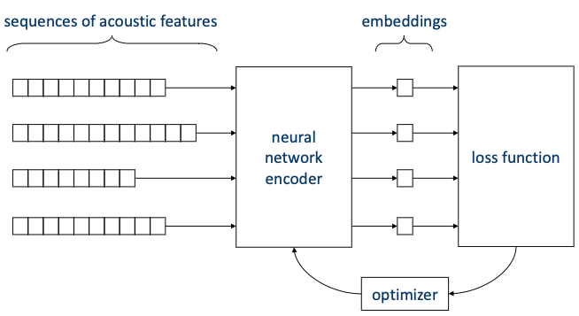

# Section 8: Speaker Recognition with Deep Learning

> [Deep learning methods in speaker recognition: a review 논문(2019)](https://arxiv.org/abs/1911.06615)

먼저 speaker recognition에 neural network를 적용하는 접근법은 크게 두 가지로 나눌 수 있다.

- indirect use: conventional framework(GMM, SVM, factor analysis, PLDA 등) 모듈을 대체

- direct use: 모든 과정을 neural network로 수행

---

## 8.1 Indirect use of neural networks

신경망을 indirect하게 사용하는 Speaker Recognitio은 세 가지 대표적인 방법이 있다.

- Tandem deep features

- DNN i-vector

- j-vector

---

### 8.1.1 Tandem deep features

> [Tandem Deep Features for Text-Dependent Speaker Verification 논문(2014)](https://futianfan.github.io/tandem_deep_InterSpeech14.pdf)

Tandem deep features는 GMM-UBM을 기반으로 하는 framework이다. 

- 기존 GMM-UBM

  MFCC 혹은 PLP와 같은 acoustic features를 입력으로 사용한다.

- Tandem deep features

  acoustic features로 학습한 세 가지 neural network의 중간값을 입력으로 사용한다.

Tandem deep features는 다음과 같은 세 가지 neural network를 사용한다.(그림의 빨간 부분이 GMM-UBM의 입력으로 사용된다.)

- Restricted Boltzmann Machine(RBM) - unsupervised

  unsupervised이므로 label이 필요하지 않다.

- Phone-discriminant DNN - supervised

  서로 다른 phonemes로부터 acoustic features를 구분할 수 있도록 학습한다.

- Speaker-discriminant DNN - supervised

  서로 다른 speaker로부터 acoustic features를 구분할 수 있도록 학습한다.

---

### 8.1.2 DNN i-vector

> [A novel scheme for speaker recognition using a phonetically-aware deep neural network 논문(2014)](https://ieeexplore.ieee.org/document/6853887)

DNN i-vector는 이름 그대로 i-vector 기반 framework이다. 우선 i-vector의 Factor Analysis 방정식은 다음과 같았다.

$$ s = m + Tw $$

- 기존 i-vector: supervector $s$ 를 GMM-UBM에서 가져온다.

- DNN i-vector: supervector $s$ 를 DNN에서 가져온다.

  이때 DNN은 triphones(세 개의 연속된 phonemes sequence)을 구분할 수 있도록 학습한다.

  

---

### 8.1.3 j-vector

> [Multi-task learning for text-dependent speaker verification 논문(2015)](https://www.semanticscholar.org/paper/Multi-task-learning-for-text-dependent-speaker-Chen-Qian/9a4adc509993ca63dac1dbfe4338e71be5d9b016)

**j-vector**(joint-vector)는 Probabilistic Linear Discriminant Analysis(PLDA)를 기반으로 하는 framework이다. j-vector에서 쓰이는 신경망은 한 번에 두 가지 task를 수행한다.

- speaker labels 구분하기

- phonemes 구분하기

> 학습 시 두 cross-entropy loss를 합산한 최종 loss를 바탕으로 학습한다. 

신경망의 결과에 PLDA를 적용하여 final speaker classification을 수행한다.

---

## 8.2 Direct use of neural networks

하지만 위와 같은 indirect use cases는 어디까지나 deep learning이 아직 성숙하지 않았을 때의 방법이다. 현재는 GMM/SVM/i-vector/PLDA와 같은 방법을 사용하지 않고, 오로지 deep learning만을 사용하여 speaker recognition을 수행한다.

- 각 audio는 acoustic features sequence로 표현된다.

- sequence는 neural network encoder의 입력으로 들어가서 embedding vector로 변환된다.

- embedding vector를 바탕으로 loss fuction을 계산한다.

- loss function을 바탕으로 neural network encoder를 optimize한다.

---

## 8.3 Inference

먼저 forward propagation에 해당되는 **inference** 과정을 살펴보자. inference의 입출력은 다음과 같다.

- 입력: runtime audio 혹은 acoustic features sequence

- 출력: speaker embedding vector

> 참고로 이러한 task를 **sequence summarization**이라고도 지칭한다. 

다양한 sequence length를 갖는 입력을 처리하기 위해서, Speaker Recognition에서는 주로 다음과 같은 inference 방법을 사용한다.

- Frame-independent inference

- Fixed window inference

- Full sequence inference

- Sliding window inference

여기서 frame은 sequence의 한 sample(20~50ms)를 의미하며, window는 연속된 frame의 집합을 의미한다.

> 네 가지로 방법을 구분하기는 했으나 실제로는 유연하게 섞어서 사용할 수 있다.

---

### 8.3.1 Frame-independent inference

Frame-independent inference(per-frame inference)이란, 다음과 같이 신경망에 모든 frame을 independent하게 입력으로 주는 방법이다.

> 주로 초기에 사용되었다.(예: Tandem deep features)

- frames는 pooling layer를 거쳐서 single embedding vector로 변환된다.

  pooling layer는 주로 average pooling을 사용한다.

방식의 장단점은 다음과 같다.

- 장점

  - 간단하다.

  - 모델을 작게 만들 수 있다.

  - 훈련이 쉽고 메모리를 적게 사용한다.

- 단점

  - 각 frame은 매우 짧은 시간에 해당되는 주기를 가지므로, 정보가 부족하다.

  - 모든 frame에 동일하게 average pooling이 적용된다.

    more relevent한 frame을 중요하게 취급하지 못한다.

---

### 8.3.2 Fixed window inference

특정 응용에서는 고정된 sequence length를 갖는 입력만을 처리한다. 이런 경우에는 다음과 같이 fixed window inference를 사용한다.

> 예를 들어 "Ok Google"과 같은 wake word detection이 있다.(**text-dependent** speaker recognition)

- frame은 하나의 거대한 **stacked frame**으로 묶여 입력으로 들어간다.

  length가 일정하므로 stacked frame 역시 일정한 차원을 갖는다.

- 출력도 일정한 차원을 갖는 embedding vector이 나온다.

방식의 장단점은 다음과 같다.

- 장점

  - 단순하다.

  - 훈련이 쉽다.

- 단점

  - 오직 text-dependent speaker recognition에만 적용할 수 있다.

  - stacked frame이 커지는 만큼 패러미터 수도 많아진다.

    > dropout/maxout과 같은 방법으로 패러미터를 일부 줄일 수는 있다.

---

### 8.3.3 Full sequence inference

Full sequence inference은 신경망 입력으로 전체 sequence를 받는 방법이다. 따라서 contextual information을 학습할 수 있지만, 이를 위해 다양한 sequence length를 갖는 입력을 처리할 수 있어야 한다. 이는 주로 **RNN** 혹은 **Attention**을 사용하여 구현된다.

---

#### 8.3.3.1 Full sequence inference: RNN

RNN에서는 각 입력에 따른 출력을 도출하나, Speaker Recognition에서는 single embedding이 필요하다. 따라서 Speaker Recognization에서는 RNN의 출력에 average pooling을 적용하거나, 마지막 embedding만을 사용한다.

> RNN은 **memory**(states)를 가지며, input frame이 서로 dependent하다.

> 받는 입력의 길이에 따라 **dynamic RNN**, static RNN으로 분류할 수 있다.

- Average pooling

  

- Last frame

  

---

#### 8.3.3.2 Full sequence inference: attention

두 가지 대표적인 attention을 살펴보자.

- Sequence to same-length sequence self-attention(**transduction**)

  각 frame마다 query $q_i$ , key $k_i$ , value $v_i$ vector를 갖는다.

$$ \mathrm{Attention}(Q, K, V) = \mathrm{softmax}\left({{QK^T} \over {\sqrt{D}}}\right) V $$

- Sequence to embedding attention(**summarization**)

  각 frame마다 value vector $v_i$ , scalar coefficient $a_i < 0$ 을 갖는다.

$$ z = {{\sum_{i=1}^T a_i v_i} \over {\sum_{i=1}^T a_i}} $$ 

---

#### 8.3.3.3 Full sequence inference: training

그런데 훈련에서는 utterance를 full sequence로 받는 것은 비효율적이다.(batch size=1) 따라서 batch를 나누는 방식으로 주로 훈련한다.

- batch는 same length를 갖는 segments로 구성된다.

- batch끼리의 segment length는 다를 수 있다.

---

### 8.3.4 Sliding window inference

sliding window inference는 full sequence를 overlapping window로 나누어서 처리하는 방법이다.

> full sequence inference와 마찬가지로 RNN 혹은 attention을 사용하여 구현한다.

- 각 window마다 independent inference를 수행한다. 

- 모든 window 결과에 average pooling을 적용하여 embedding vector를 얻는다.

  > 오직 inference에서만 pooling이 적용되며, 훈련에서는 pooling이 적용되지 않는다.(pooling은 패러미터를 갖지 않는 단순한 연산이다.)

하지만 overlap으로 발생하는 연산 비용의 증가, 모든 window 연산을 기다리면서 발생하는 latency와 같은 문제점을 갖는다.

---